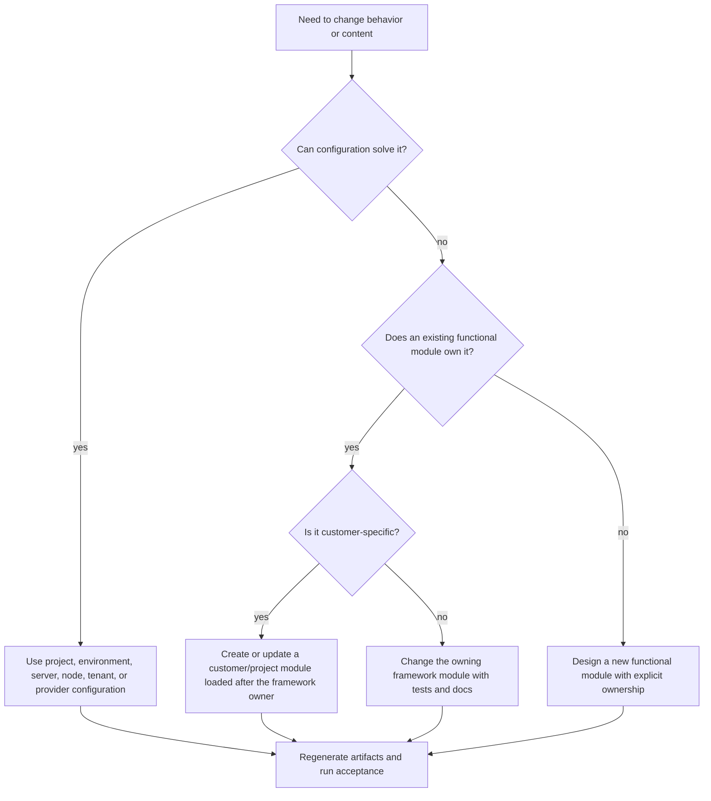

# Customer Customization Guide

Kickoff is intentionally small. It should teach partners how to customize
Nodics safely without turning the reference project into another framework
repository.

For a beginner developer, the most important lesson is restraint. Do not start
by editing framework files because they are easy to find. Start by asking who
owns the behavior, whether configuration can solve the need, and which runtime
server should load the customization. That habit keeps the customer project
upgradeable.

## Why customization needs rules

Most enterprise projects start with one urgent customer request. The quickest
solution is often to edit whatever file is easiest to find. That works for a
demo, but it becomes expensive when more customers, tenants, brands, modules,
and releases arrive. Nodics customization rules keep the framework upgradeable
and keep customer behavior visible in the customer project.

The rule is simple: customize in the most specific owner that needs the
change. Use configuration before code. Use a project module before editing a
framework module. Use a later-loaded extension module before forking a standard
functional module. Create a new functional module only when the business
capability is genuinely new.

## Customization decision tree

Use this decision tree before changing code:



If you cannot answer the ownership question, do not code yet. A wrong owner is
more expensive than a missing implementation because it creates a hidden
contract future teams will inherit.

## How a developer or AI tool should think

Kickoff is a reference customer project, so every change teaches future
customers what “good” looks like. A developer or AI tool should not behave like
a script that only edits the nearest file. It should behave like a small expert
team:

| Role | What to check in Kickoff |
| --- | --- |
| Business analyst | Does this make the first-hour customer experience clearer, safer, or more convincing? |
| Enterprise architect | Does the change preserve framework, customer project, runtime server, Axis, WCMS, Profile, and BackOffice ownership? |
| Nodics framework expert | Is the behavior a project customization, a framework capability, a server topology decision, or generated content-pack output? |
| Domain expert | Is the sample reusable enough for future commerce, workflow, content, integration, or industry-specific examples? |
| Principal engineer | Can this be solved through configuration, project module overlay, generated documentation source, or a small exported function? |
| QA and tester | Does the setup work from zero database state, repeated runs, missing services, and failed dependency resolution? |
| TechOps/DevOps reviewer | Are framework paths, local databases, ports, logs, reset scope, and rollback behavior safe and understandable? |

If the answer is unclear, stop and name the ownership decision before editing.
For example, changing the local WCMS database name belongs in server
configuration, while changing the import checksum rule belongs in the owning
framework import service.

## File placement examples

Use these examples when deciding where code or data belongs:

| Need | Correct owner | Why |
| --- | --- | --- |
| Change local Platform port | `envs/kickoffLocal/platformServer/config` | It is server topology, not framework behavior. |
| Add a project-only service | `modules/<project-module>` | Customer behavior should load after framework modules. |
| Explain Kickoff setup in Axis docs | `nodics.kickoff/data/core/source/documentation` | Kickoff owns project documentation that becomes CMS data. |
| Change Axis renderer behavior | `nodics.axis` | Browser rendering is frontend code, not customer backend data. |
| Change framework-wide import validation | `nodics.ai` owning module | Shared behavior belongs to the framework owner. |
| Change generated CMS record text | Source Markdown, then regenerate | Generated files are projections and must not become manual authority. |

## Configuration-first examples

Configuration-first does not mean "put everything in properties." It means use
the correct configuration owner before writing code.

| Example change | Better first move | Why |
| --- | --- | --- |
| Local WCMS port must change | Server config under `envs/.../wcmsServer/config` | Port is topology, not shared framework behavior. |
| A project wants a different public label | WCMS/Axis content or project-owned documentation/content data | The label is presentation/content, not service logic. |
| A local dependency path differs | `.env` with `NODICS_FRAMEWORK_ROOT`, then `configure:framework` | Workspace layout is developer-specific. |
| A new API category should be enabled | Owning module default property, with server override only to disable or narrow it | Defaults belong to the module that owns the API. |
| A new lifecycle state is needed | Owning status-definition file | Status values are contracts, not casual properties. |
| A customer needs different Profile behavior | Customer extension module loaded after Platform/Profile owner | Customer behavior should not fork framework source. |

## Safe customization model

Customer projects can add project modules under `modules/` and environment or
server contributions under `envs/`. These contributions load after standard
Nodics functional modules and can override or extend services through the
normal module merge process.

Safe customizations include:

- project-specific configuration;
- customer modules such as `kickoffCore`, `kickoffApi`, or `kickoffInt`;
- customer extension modules such as a future `kickoff.platform`;
- environment-specific properties for local, testing, pre-production, and
  production;
- project-owned CMS documentation content packs;
- sample data or initialization flows that belong to the customer project.

## Two customization types

### Code-level customization

Use code-level customization when behavior changes: a service needs different
logic, a route needs a project-specific policy, a schema needs project fields,
or an integration must call a customer system. Keep the implementation in a
Kickoff module or a customer extension module. Add tests next to the changed
owner and document the boundary in the module README or documentation page.

Example mental model:

```text
nodics.core
nodics.platform
kickoff.platform
nodics.kickoff
kickoffLocal
platformServer
```

Here `kickoff.platform` can override or compose Platform services because it
loads later. Axis and BackOffice should still show the functional capability as
Platform unless the customer intentionally exposes a new business capability.

### Axis and WCMS customization

Use governed frontend customization when an administrator changes content,
labels, navigation, documentation, images, or page composition through Axis
and WCMS. The browser renderer stays in `nodics.axis`; the content records live
in the backend owner. For example, changing a demo site logo should become a
governed WCMS, Media, or content update, not a hard-coded replacement inside
the Axis source repository.

### Documentation customization

Documentation customization is content customization. If a customer wants
their own onboarding guide, project setup page, API usage note, operational
runbook, or business process explanation, the content belongs in the customer
project documentation pack.

The source lives under:

```text
data/core/source/documentation/
  catalogue.json
  pages/
```

The generated files live under:

```text
data/core/data/documentation/
data/manifest.json
```

Edit the source, bump the catalogue version, regenerate, test, import, and
verify in Axis. Never hand-edit the generated CMS records to make a page look
right.

## What not to customize in Kickoff

Do not copy Core, Platform, WCMS, Cron, or Axis source into Kickoff. Do not
rename standard functional identities such as `nodics.platform` just because a
customer extension customizes their behavior. Do not put backend-importable CMS
data into the frontend repository. Do not place framework documentation in the
customer project unless it is truly project-specific guidance.

## Extension example

A customer may later create a module such as `kickoff.platform` to customize
Platform behavior. A Platform server could load:

```text
nodics.core
nodics.platform
kickoff.platform
nodics.kickoff
kickoffLocal
platformServer
```

BackOffice and Axis should still present the functional capability as Platform
unless the customer explicitly exposes a separate functional module. The
extension changes implementation; it does not create a new product identity.

## Documentation rule

Customer documentation follows the same ownership rule:

- framework guidance goes to `nodics.docs`;
- Axis product guidance goes to Platform `modules/axis`;
- Kickoff/project guidance goes to `nodics.kickoff`;
- browser rendering remains in `nodics.axis`.

When Kickoff docs change, update the source page, bump the catalogue version if
the generated content changes, regenerate the pack, import it through WCMS, and
verify the route in Axis.

## Step-by-step: add a small project module

1. Create or choose a module under `modules/`.
2. Give the module a clear package identity and index so load order is
   intentional.
3. Add only project-owned services, data, configuration, or routes.
4. Register the module in the relevant environment/server composition.
5. Start the server and verify logs show the module loading after framework
   modules.
6. Add or update tests proving the project behavior.
7. Update Kickoff documentation if the customization is part of the reference
   journey.

### Example: adding a project service

Suppose a customer wants a project-only greeting service for a demo dashboard.
The safe thought process is:

1. The behavior is not framework-wide.
2. The behavior belongs to the customer project.
3. The implementation should live under a project module, for example
   `modules/kickoffCore`.
4. The service should be exported so a later module can override or compose it.
5. A test should prove the default behavior and the override path.
6. The documentation should explain the example if it teaches future partners.

Do not add that demo service to `nodics.core` only because every runtime loads
Core. Core is the shared foundation, not a bucket for convenient code.

Do not use this flow to move framework behavior into Kickoff. If the behavior
belongs to Core, Platform, WCMS, Cron, or Media for all customers, propose and
implement it in the owning framework module instead.

## Step-by-step: add project documentation

1. Add or update Markdown under
   `data/core/source/documentation/pages/`.
2. Update `data/core/source/documentation/catalogue.json`.
3. Bump the catalogue version when generated content changes.
4. Run `npm run docs:generate`.
5. Run `npm run test:documentation`.
6. Import or update the content pack through Axis.
7. Open the generated `/docs/nodics-kickoff` route in Axis and verify
   navigation, search, headings, and previous/next links.

## DevOps and rollback notes

Project customizations should be deployable and reversible. Keep project
configuration separate from private secrets. Record which environment and
server a customization affects. If a release fails, rollback should remove or
disable the project layer without requiring a framework source rollback.

Operators should be able to answer three questions during rollback: which
project module introduced the change, which server graph loaded it, and which
content-pack or configuration version went live. If those answers are unclear,
the customization is not ready for a production environment.

Generated documentation and seed data should be versioned immutably. If content
changes with the same version, the import service should reject it so operators
do not silently install a different release under an already-trusted identity.

## Common mistakes

- Editing framework files for a project-only demonstration change.
- Treating the reference project name as a requirement for every customer
  project.
- Putting customer documentation into the framework docs module.
- Changing a standard functional module identity when only a customer overlay
  is being added.
- Copying whole framework property trees into an environment/server config
  instead of overriding only the narrow property the project needs.
- Editing generated documentation data after a checksum failure instead of
  updating source Markdown, regenerating, and bumping the release when
  required.

## Verification

Verify a customer customization from the outside and from the owner. From the
outside, start the relevant local server, open Axis, and confirm the visible
behavior changes only for the project that owns it. From the owner, run the
project tests, regenerate project documentation content when docs changed,
validate the content-pack manifest, and run the local acceptance script when
runtime, import, module registry, documentation, or Axis behavior is affected.

If a customization changes Platform, WCMS, Cron, or another framework
capability through a project overlay, the evidence must show both the default
framework behavior and the project-specific override. A beginner should be
able to read the evidence and understand where the change lives, why it does
not fork the framework, and how to remove or roll it back.

## Continue

- [Kickoff project overview](project-overview.md)
- [Local runtime topology](local-runtime.md)
