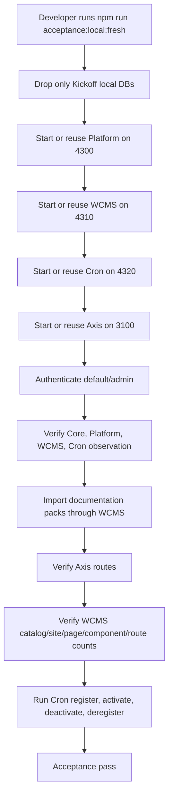

# Local Acceptance Checklist

This checklist is the beginner-friendly path for proving a fresh Nodics local
installation from zero database state. Use it when you have cloned the three
working repositories, configured Kickoff, and want to confirm the backend
framework, customer project, and Axis frontend are working together.

The checklist is intentionally explicit. A new developer should be able to
follow it without already knowing Nodics module loading, BackOffice bootstrap,
WCMS content packs, or functional-module registration.

## What this checklist proves

The acceptance run proves five things:

| Area | What must be true |
| --- | --- |
| Framework checkout | Kickoff can resolve Core, Platform, WCMS, and Cron from the configured framework root. |
| Runtime topology | Platform, WCMS, and Cron can start from the Kickoff local environment. |
| Bootstrap data | Mandatory initialization data can be imported from module-owned releases. |
| Axis access | Axis can connect to Platform, authenticate the local admin, and discover BackOffice bootstrap data. |
| Module lifecycle | Core, Platform, and WCMS are mandatory/registered; Cron is observable as an optional runtime module. |

If any one of these fails, do not continue adding new functional modules. Fix
the contract break first, otherwise every later module will inherit a shaky
local foundation.

## Repository layout used by the reference run

The local reference setup normally looks like this:

```text
nodicsRoot/
  nodics.ai/
  nodics.axis/
  nodics.kickoff/
```

This layout is only a convenience. Customer projects may live anywhere. The
important contract is that `nodics.kickoff/.env` tells Kickoff where the
framework checkout lives.

```dotenv
NODICS_FRAMEWORK_ROOT=../nodics.ai
```

Use an absolute path if your repositories are not parallel:

```dotenv
NODICS_FRAMEWORK_ROOT=/Users/example/projects/framework/nodics.ai
```

## Mandatory prerequisites

Before running the checklist, confirm these local services and tools are
available:

1. Node.js 24 and npm.
2. MongoDB running locally.
3. The three repositories are cloned:
   - `nodics.ai`
   - `nodics.axis`
   - `nodics.kickoff`
4. `nodics.kickoff/.env` exists and points to the framework root.
5. `nodics.axis/.env` points to the local Platform server.

Run this from `nodics.kickoff`:

```bash
cp .env.example .env
npm run configure:framework
npm install
```

Run this from `nodics.axis`:

```bash
cp .env.example .env
npm install
```

## Fresh database reset

Use a fresh database reset only for local developer acceptance. Do not run this
against a shared development, QA, pre-production, or production database.

The local server configs own the exact database names. Read them before
dropping anything. In the reference topology, the relevant server configs are:

```text
envs/kickoffLocal/platformServer/config/properties.js
envs/kickoffLocal/wcmsServer/config/properties.js
envs/kickoffLocal/cronServer/config/properties.js
```

The reset should remove only the local Kickoff runtime databases/schemas used
by those servers. It must not delete a broad MongoDB instance, user home
folder, workspace folder, or unrelated project database.

## Automated acceptance path

Most maintainers should use the automated path first. It proves the same
contracts as the manual checklist and reduces human mistakes during repeated
bootstrap tests.

Run this from `nodics.kickoff`:

```bash
npm run acceptance:local:fresh
```

This command intentionally drops only the three reference local databases:

- `kickoffLocal`
- `kickoffLocalWcms`
- `kickoffLocalCron`

It then starts any missing local servers, waits for Platform, WCMS, Cron, and
Axis to become reachable, authenticates the local admin, imports the Framework,
Nodics Axis, and Nodics Kickoff documentation packs through WCMS, checks key
Axis routes, verifies WCMS content counts, and runs the Axis live smoke with
the documentation and Cron lifecycle gates enabled.

Use the safer non-destructive form when you only want to verify the current
local state:

```bash
npm run acceptance:local
```

That version does not drop databases. It checks the currently running or
started local topology and imports missing documentation packs if required.

### What the automated command proves



The command stops the servers it started after the acceptance gates complete.
If you want to keep the stack running so you can inspect Axis after the run,
use:

```bash
node scripts/local-bootstrap-acceptance.mjs --drop-local-db --leave-started
```

The command is deliberately conservative. It does not discover and drop random
MongoDB databases. It does not kill unrelated processes. It does not create
another importer. It uses the existing Profile login, BackOffice registry,
WCMS content-pack API, and Axis smoke test. This matters because acceptance
must prove the same path a real developer or operator uses.

## Start the backend servers

Open three terminals from `nodics.kickoff`.

Terminal 1:

```bash
npm run start:platform
```

Terminal 2:

```bash
npm run start:wcms
```

Terminal 3:

```bash
npm run start:cron
```

Expected local ports:

| Runtime | Port | Why it matters |
| --- | ---: | --- |
| Platform | 4300 | Profile login, BackOffice bootstrap, module registry, OpenAPI discovery. |
| WCMS | 4310 | CMS sites, content catalogs, page/component data, documentation packs, media metadata. |
| Cron | 4320 | Optional runtime module observation and registry lifecycle testing. |

If a port is already in use, confirm whether it is an earlier Nodics server
from the same checkout. Do not kill unrelated processes by guessing.

## Start Axis

Open another terminal from `nodics.axis`:

```bash
npm run dev
```

Axis should be available at:

```text
http://localhost:3100
```

## Login

Open Axis and use the local reference credentials:

```text
Enterprise: default
Login ID: admin
Password: adminPassword
```

Successful login proves:

1. Axis can load public bootstrap from Platform.
2. Profile can authenticate the local admin.
3. Axis can retrieve authenticated BackOffice bootstrap data.
4. Axis receives authorized navigation and runtime module projections.

## Import initialization data

In Axis, open the import/initialization workspace and install the available
initialization releases.

You should see releases owned by active modules only. The system must not ask
Axis to invent import data. Axis presents the operation; the owning backend
module and nImport execute the import.

Expected outcome:

- mandatory Profile/bootstrap identity data is available;
- core framework data required by Platform and WCMS is present;
- documentation content packs can be imported or updated;
- repeated import attempts with unchanged immutable releases do not corrupt
  existing data.

## Verify module registry

Open:

```text
System and Integrations → Module Registry
```

Expected state:

| Functional module | Expected state | Why |
| --- | --- | --- |
| `nodics.core` | Registered and active | Required by every runtime. |
| `nodics.platform` | Registered and active | Required for Profile, BackOffice, and Axis bootstrap. |
| `nodics.wcms` | Registered and active | Required for CMS, documentation, and media/content management. |
| `nodics.cron` | Optional, observed when Cron is running | Proves optional runtime modules can join the lifecycle. |

Core, Platform, and WCMS are mandatory for this local Axis-backed acceptance
topology. They should not appear as removable optional modules. Cron may be
registered, activated, deactivated, and deregistered as an optional module.

## Verify documentation

Open:

```text
Documentation
```

Expected documentation products:

- Framework
- Swaggers
- Nodics Axis
- Nodics Kickoff

The products are intentionally separated by ownership:

| Documentation product | Owning repository/module |
| --- | --- |
| Framework | `nodics.ai/nodics.docs` |
| Nodics Axis | `nodics.ai/nodics.platform/modules/axis` |
| Nodics Kickoff | `nodics.kickoff` |
| Swagger/OpenAPI | Platform BackOffice/OpenAPI contracts |

Axis is only the renderer. It must not own backend-importable documentation
content.

## Verify content and media

Open these Axis routes:

```text
/content
/media
/media/items
/media/folders
```

Expected behavior:

- `/content` shows the content dashboard and WCMS-owned summary sections.
- `/media` shows media management, media records, and media-by-source sections.
- `/media/items` and `/media/folders` open focused media workspaces instead of
  falling into CMS recovery.
- Any unavailable backend schema is reported as a backend/schema discovery
  issue, not as a frontend-owned data model.

## Verify Cron

Open:

```text
/cron
```

Expected behavior:

- If Cron is running, Axis can observe the `nodics.cron` functional module.
- If Cron is not registered, it appears as available to register.
- Register moves it into the registered list without requiring a page refresh.
- Activate changes lifecycle state without freezing buttons.
- Deactivate and deregister return it to the correct next state.

The automated acceptance runner performs the full optional Cron lifecycle:

```text
available → register → registered/inactive → activate → registered/active
registered/active → deactivate → registered/inactive → deregister → available
```

Cron is optional for the project, so the final accepted state after the
automated lifecycle test is **available** rather than permanently registered.
That proves both the runtime observation path and the governed removal path.

If an action succeeds but the UI does not update, inspect the module registry
API response immediately after the action. The frontend should refresh local
query state after each lifecycle operation.

## Command-line smoke test

After the servers and Axis are running, use the live smoke script from
`nodics.axis`:

```bash
AXIS_EXPECT_MODULES=1 npm run smoke:live
AXIS_EXPECT_MODULES=1 AXIS_EXPECT_DOCUMENTATION=1 npm run smoke:live
AXIS_EXPECT_MODULES=1 AXIS_EXPECT_DOCUMENTATION=1 AXIS_CRON_LIFECYCLE=1 npm run smoke:live
```

Expected result:

```text
PASS Axis route /
PASS Axis route /content
PASS Axis route /media
PASS Axis route /media/items
PASS Axis route /media/folders
PASS Axis route /cron
PASS Axis route /system-integrations
PASS Axis route /system
PASS Axis route /system/modules
PASS BackOffice public bootstrap
PASS authenticated login for admin
PASS module registry reachable
PASS required modules registered: nodics.core, nodics.platform, nodics.wcms
PASS optional runtime modules observed: nodics.cron
PASS documentation pack nodicsDocumentation is CURRENT
PASS documentation pack axisDocumentation is CURRENT
PASS documentation pack kickoffDocumentation is CURRENT
PASS cron lifecycle register
PASS cron lifecycle activate
PASS cron lifecycle deactivate
PASS cron lifecycle deregister returns module to available
```

## Troubleshooting quick map

| Symptom | Most likely boundary |
| --- | --- |
| Axis recovery says BackOffice registry unavailable | Platform server is not reachable or Axis points at the wrong Platform URL. |
| Login fails | Profile data was not imported, credentials changed, or Platform is using a different database. |
| Documentation route shows CMS recovery | WCMS is down, documentation pack is not imported, or the documentation source is not registered. |
| Import page says API category is disabled | API exposure defaults belong in owning modules; check whether the runtime disabled the category at server level. |
| Cron does not appear | Cron server is not running or has not reported its functional module observation. |
| Module action succeeds only after refresh | Axis query invalidation or backend response envelope needs review. |
| Media schema discovery unavailable | WCMS/media runtime is not exposing the expected schema workbench contract. |

## Acceptance sign-off

The local acceptance run is complete when:

1. Platform, WCMS, Cron, and Axis are running.
2. Fresh local databases were created from module-owned import data.
3. Admin login works.
4. Module registry shows mandatory modules and optional Cron correctly.
5. Documentation products are visible.
6. Content and media routes render the expected workspaces.
7. `npm run acceptance:local:fresh` passes, or the manual equivalent plus
   `AXIS_EXPECT_MODULES=1 AXIS_EXPECT_DOCUMENTATION=1 AXIS_CRON_LIFECYCLE=1 npm run smoke:live`
   passes.
8. No repo in the three-repo set has uncommitted acceptance changes.

When all eight are true, the modularized foundation is ready for the next
functional module.

## Common mistakes

- Treating a running Node process as proof that the customer project is ready.
- Skipping content-pack import and then wondering why Axis documentation or
  WCMS pages are unavailable.
- Dropping or modifying broad databases during a local test instead of using
  the bounded fresh-bootstrap command intended for the reference environment.
- Accepting a module lifecycle flow that requires a browser refresh after
  register, activate, deactivate, or deregister.
- Ignoring an `INVALID RELEASE` message because the release still appears in
  the list.
- Verifying only Platform while forgetting WCMS, documentation, media, Cron,
  and Axis routes.

## Verification

Run the checklist twice when confidence matters: once against the currently
running local database and once with the bounded fresh-bootstrap option. The
expected result is repeatability. The system should rebuild from backend-owned
data, import documentation and initialization releases through governed APIs,
show healthy CMS record counts, expose mandatory modules, handle optional Cron
lifecycle, and render Axis routes without manual database edits.

For project documentation changes, regenerate the Kickoff documentation pack,
run the documentation contract test, start Platform and WCMS, import or update
the Kickoff docs release, and open `/docs/nodics-kickoff` in Axis. If the page
only works because it was hardcoded in the frontend, the acceptance result is
not valid.
