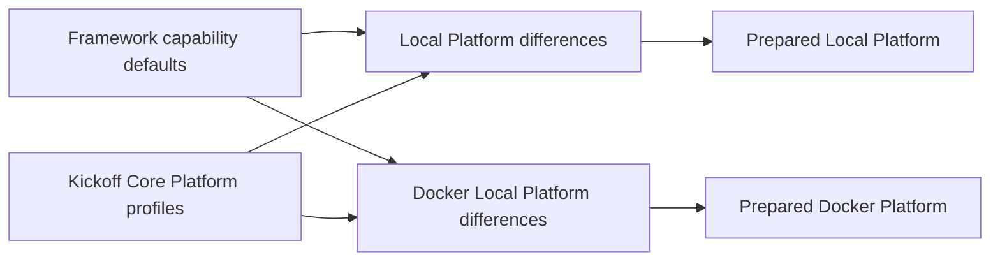

# Keep Kickoff configuration small

Kickoff inherits tested framework defaults. Its environment and server files
hold deployment choices and intentional differences. Shared customer
administration descriptions live once in `kickoffCore` as Platform runtime-role
profiles. Customers can change their applications without maintaining copies of
framework behavior or adding a separate configuration-only module.

For a beginner, start with the existing Local Platform example below and change
one value. Read the resulting prepared configuration before adding another
override; do not copy a complete framework file as a starting template.

## Business outcome

A business administrator chooses which applications to prepare and which
approved packages to install. Developers maintain those customer choices once;
operators maintain the actual deployment connections. Inherited defaults reduce
the settings a partner must learn while retaining explicit control over imports,
publication and reset operations.

## Understand the ownership before editing

| Concern | Kickoff location | What stays inherited |
| --- | --- | --- |
| Shared project administration profiles | `modules/kickoffCore/config/properties.js` under Platform runtime-role profiles | BackOffice orchestration, permissions, validation and imports |
| Local Platform transport and local-only profile differences | `envs/kickoffLocal/platformServer/config/properties.js` | Shared customer descriptors and capability defaults |
| Docker Local Platform differences | `envs/kickoffDockerLocal/platformServer/config/properties.js` and its existing topology contributions | Shared customer descriptors and framework behavior |
| Local environment policy | `envs/kickoffLocal/config/properties.js` | Generic CORS cache duration and other unchanged capability defaults |
| Docker environment policy | `envs/kickoffDockerLocal/config/properties.js` | Generic defaults, with Docker-specific origins and headers retained |
| Customer commerce policy | Local/Docker Commerce and Commerce Staged properties | Neutral framework behavior; the actual Agora store remains explicit |
| Circa application policy | `modules/circa.ewaste/config/properties.js` | Waste, Profile, Location and BackOffice authorities |

`kickoffCore` owns descriptors common to Local and Docker Local, including
application identity/presentation, equal data-package lists and shared
activation selections. nConfig projects those descriptors only when the selected
runtime role is Platform. The descriptors contain no deployment credential,
port, listener, or startup behavior. Environment and server files still own the
actual deployment transport differences.



## Why the ordering matters

`kickoffCore` is part of the project module graph. Its BackOffice descriptors
use `runtimeRoleProfiles.PLATFORM`, so Platform receives them and non-Platform
runtimes do not. The selected Platform server files keep deployment-specific
overrides such as operator origin or target transport details.

The normal nConfig loader remains authoritative. There is no additional loader,
profile registry, deployment process or project lifecycle script. Existing
Circa and other later-loaded contributions retain their own merge behavior.
An index change must be reviewed against the effective module order rather than
assumed safe from a directory name.

## Start with the smallest change

For Local employee browser sessions, the environment needs only its intentional
local policy:

```js
profileBrowserSession: {
    enabled: true,
    allowInsecureLoopback: true,
    sameSite: 'Lax'
}
```

Cookie names, cookie paths and maximum age come from Profile. These are local
settings; do not copy loopback relaxation into a production environment unless
that deployment explicitly supports local HTTP development. Docker keeps its
distinct cookie names at the Docker environment layer so Local and Docker browser
sessions remain separate.

For a Product catalogue limit, add only the value you intend to change under
an already active Commerce server:

```js
product: {
    discovery: { catalogue: { maximumCandidates: 800 } }
}
```

Omitting `maximumCandidates` uses Product's default. Other Product values do not
need to be copied. Changes to query budgets require performance review against
the intended catalogue size.

## Customize and extend safely

To change a shared application description, edit the matching Platform profile in
`modules/kickoffCore/config/properties.js`. To change a deployment
connection, edit that environment's Platform profile target. For example, a
Local-only timeout override is:

```js
backofficeApplicationInitialization: {
    profiles: {
        nexus: { target: { timeoutMs: 60000 } }
    }
}
```

Merge this difference into the existing Local Platform properties. Do not
replace the entire file or copy this target into the shared module. The profile
continues to inherit its description and package selections; Docker retains its
own target values. A node override can further specialize this scalar through
the existing selected-node configuration chain.

When adding a new application, first decide whether its descriptor belongs to
an already active application module or to administrative composition. Prefer
the application owner where it can contribute without activating unrelated
capabilities. Keep shared cross-application administration data here only when
that is the appropriate selected consumer. Local-only profiles remain Local
choices; identical data is shared only where both environments intend it.

When adding a new environment or server:

1. Follow the framework module-generation contract and choose a unique ordered
   index; do not copy an existing server's complete properties.
2. Declare actual composition, coordinates, authority and required deployment
   inputs.
3. Keep shared administration defaults in the owning project/application module
   and expose them through runtime-role profiles only for consuming runtimes.
4. Add only intentional differences, then run preparation and focused checks.
5. Test an unselected runtime to ensure that it does not gain application
   profiles or functional modules accidentally.

## Preserve arrays and operational safeguards

Current nConfig merges arrays by position. A shorter override can retain
inherited trailing entries; an empty array is not a general removal instruction.
This migration shares a list only when the complete values match. Deployment
lists that differ remain explicitly owned at their boundary. Use an existing
capability-specific removal mechanism where available and verify the effective
result before changing an activation or reset inventory.

Local reset opt-in, its environment allowlist and explicit model service lists
remain Local configuration. Shared defaults do not enable Docker Local reset.
Provider sandbox restrictions and deployment-selected model names remain
explicit where they represent intentional operator policy. Data descriptors do
not themselves execute imports, grant permissions, approve Online publication
or change tenant authority.

Large remaining blocks are not automatically framework defaults: deployment
knowledge-source bindings, transport targets, local-only application profiles
and reset inventories can carry real customer or server choices. Their ownership
must be assessed individually. A shorter entry file that imports the same large
payload does not reduce customer maintenance by itself.

## Send store context explicitly

Cart and Shopping List no longer select a store from `customerApi.defaultStoreCode`.
The obsolete Cart fallback declarations have been removed from Local and Docker
Local Commerce/Commerce Staged configuration. Store identity remains customer-owned;
the existing Agora commerce client sends its configured store explicitly for Cart
creation and Shopping List operations.

Before upgrading other callers, make them send `storeCode` through their existing
request payload/query or service context. All supplied values must agree. Missing,
malformed or conflicting context is rejected; no neutral or sample store is invented.
There is no new configuration layer or store-specific API. Other application-level
store selections used by Product publication or other capabilities have independent
owners and are not removed by this change.

Existing explicit-store ID formats and persisted records are preserved. Keep saved
Cart IDs, including any produced by the older context-only hashing bug; recomputing
a new hash is not a migration. Missing/inconsistent stored context needs governed
repair. Identifier validation is not a Store master lookup or an authorization grant.
Re-run prepared Commerce compositions and real client acceptance before deployment.

## Verification before operating

From the Kickoff repository:

```sh
node --test test/configurationInheritanceContract.test.js test/guidedInitializationProfilesContract.test.js test/communicationActivationDataContract.test.js test/dockerLocalEnvironmentContract.test.mjs
node test/runtime-prepare.test.js
node test/dockerLocalRuntimePrepare.test.js
npm run docs:generate
npm run docs:check
```

The configuration contract checks selection scope, index order, inherited
profile identity, environment-owned transports, a later node override and reset
boundaries. Existing runtime preparation checks use real nConfig resolution for
Local and Docker Local. Declaration tests compose the shared defaults instead
of assuming that a server file contains its entire effective configuration.

For this refactor, complete before/after preparation comparisons covered nine
Local and ten Docker Local runtimes across five domain selections: all, none,
Apparel, Electronics and Telco. These checks verify that Platform receives the
project-owned BackOffice descriptors through `kickoffCore` runtime-role profiles
while non-Platform runtimes do not. They prepare configuration and metadata; they do not
start listeners, reset databases, import packages or prove signed-in browser
behavior. Re-run the relevant operational journey after deploying/restarting
changed source through the usual project procedure.

## Common mistakes, troubleshooting and rollback

| Symptom | Check | Recovery |
| --- | --- | --- |
| Platform profile identity or package list is missing | Does `kickoffCore` still define Platform runtime-role profiles and does nConfig project them? | Restore the profile block; run preparation. |
| A target is missing | Does the selected environment still declare its profile transport? | Restore that environment's target; shared defaults intentionally do not supply it. |
| A Local setting appears in Docker | Was deployment data placed in the shared module? | Move it back to the appropriate environment and compare both runtimes. |
| An extra array item remains | Did a shorter array merge preserve a trailing entry? | Use supported removal semantics and inspect the effective list. |
| An unrelated server exposes shared profiles | Was the module selected by a common group or every server? | Restore Platform-only selection and run the unselected-runtime check. |
| Structure audit reports unrelated Circa gaps | Compare with the recorded baseline and inspect the owning work. | Keep those findings separate; do not overwrite ongoing Circa changes. |

Rollback restores the previous declarations together. Re-run preparation before
restarting. Do not revert unrelated Circa, content, initialization or framework
documentation changes.

Continue with the Customer Customization Guide for application extension and
the Local Runtime guide for deployment composition. The framework's permanent
rule is `nSetup/llm/contracts/customer-config-classification-contract.md` in the
resolved Foundation package.

## Commands and capability inventories

The framework supplies shared tooling operations. This project's server aliases
are discovered from `envs/*` server metadata, and application-specific scripts
are discovered from conventional files under `scripts/acceptance`. For example,
`acceptance:agora-commerce` launches the project-owned customer journey through
the shared executor. Moving ownership does not authorize executing that journey:
its existing credential, import, startup and destructive confirmation gates apply.

The shared documentation generator reads this project's `docs/catalogue.json`
publication metadata. Record/code prefixes and routes are stable persisted
identifiers; changing them requires an explicit content migration. Labels and
channels remain application choices. A different project supplies its own values
without editing framework source.

Local reset definitions select capability inventories through module-owned
`localResetProvider.profiles` keyed by runtime role. Each profile selects
capability modules and required model checks for that runtime; adding a
contribution never enables reset by itself. Environment configuration owns the
enablement and allowlist, with optional runtime-role allowlists for constrained
environments such as Docker Local. Server `config/properties.js` files do not
repeat reset inventories. A later `serviceOverrides` false entry removes an
optional inherited service. Removing a required service fails before mutation.
Explicit optional service names for unavailable or historical models remain
visible until their owners are selected or their cleanup requirements are
retired. No reset is implied by configuration preparation or validation.

Foundation initialization profiles continue selecting their declared Init/Core
categories and destination roles. Release discovery and manifests determine each
capability's records; application bundles and captions remain project choices.

## Declarative environment and runtime configuration

`package.json` identifies modules, environments, servers and nodes. Existing
`config/properties.js` contributions supply their configuration. The retired
`nodics.environment.json` is neither required nor loaded, and no replacement
descriptor is introduced. nConfig owns binding and layering; nTooling projects
startup, container and acceptance inputs from that same configuration.

Root `activeModules.compositions.agora` describes this project's optional Agora
selection. Only selecting runtime contributions consume it. Independent cron or
website projects do not need Agora. Runtime provider/module selections stay
explicit; merely declaring an endpoint or connection never activates its owner.

Each server declares its own `servers.default.endpoint` port. Peer aliases use
`$config: runtime` to project that server's endpoint, retaining intentional
`remoteOnly`, advertised-host and HTTP-only differences. Module identity and
package versions come from existing metadata. Framework host defaults are inherited.
A node may override a target endpoint field; a later tenant override changes the
actual consumer endpoint. References preserve their contribution-time snapshot.
Missing, unsafe or cyclic targets fail before runtime startup.

Local startup order and dependencies remain in each server's `tooling.runtime`.
Acceptance runtime descriptors are selected from declared roles and existing
server metadata; ports and launch commands are not repeated in Local properties. Acceptance URL defaults use nTooling's `projectEndpointUrl` projection,
including the configured Axis origin. Explicit published-URL environment inputs
remain valid for proxy or container access. Local Redis inherits the framework
host, port and `localRuntimeAuth` prefix; its Redis block declares only
`enabled: true`. A different deployment namespace is an intentional later override.
Frontend applications own their startup commands and development ports. Backend
configuration declares only explicit CORS security policy for trusted origins. Container-specific inputs and real deployment differences remain
under the existing environment's `tooling` property. Reusable acceptance defaults
come from their framework capability owners; the Local tooling block is absent. This metadata never authorizes
imports, grants runtime scope or proves deployed readiness.

## Inherited provider and policy defaults

Local Elasticsearch uses the framework provider's `http://localhost:9200` default.
Kickoff Local declares no Elasticsearch address. Docker overrides it with the
container service address because that deployment differs. Apply this rule to
all provider settings: retain only actual environment differences, connection
selection and isolated database/namespace choices.

Framework defaults provide info logging, disabled remote event publication,
disabled database fallback for search, standard CORS headers/credential behavior,
and secured service-registry API exposure. Docker's logging environment input and
cross-origin resource header are deliberate deployment differences. Search and
cache providers still require explicit activation. Server database names and
Process's separate Cron database remain project deployment choices.

The effective deployment classification remains `environment.class` for nImport
release-scope checks, but nConfig derives it from the selected environment
module metadata. Do not author it in environment `properties.js`, and do not
infer it from a runtime name such as `kickoffLocal`. Sample releases are
available for authorized manual execution by default; only Init runs
automatically. Permissions, tenant/destination checks, release integrity and
durable receipts remain mandatory. A deployment may explicitly restrict Sample
execution without changing framework code.

## Credentials, initialization and runtime authentication

Auth policy and bootstrap credential bindings come from nAuth. Kickoff does not
declare a customer-root administrator password. Environment, server and node
layers may override `bootstrapIdentity.adminPassword` through nConfig when a
deployment intentionally supplies a different initial administrator credential.
This configures future initialization; changing it does not rotate an already
persisted administrator password. Use Profile credential operations for an
existing account.

Administrator bootstrap values, JWT secrets, peppers, service passwords/API
keys and binding fallbacks remain deployment inputs or governed runtime
configuration. Do not publish credential-bearing customer files or enable
blanket legacy-human/plaintext/missing-stamp compatibility exceptions.

Supply deployment inputs through the framework's environment bindings or the
existing layered external/secret-provider mechanism:

| Input | Purpose |
| --- | --- |
| `NODICS_JWT_SECRET` | Stable deployment signing material |
| `NODICS_API_KEY_PEPPER` | Stable API-key digest material |
| `NODICS_BOOTSTRAP_ADMIN_PASSWORD` | Initial human administrator provisioning |
| `NODICS_BOOTSTRAP_SERVICE_PASSWORD` | Initial service-principal provisioning |
| `NODICS_BOOTSTRAP_SERVICE_API_KEY` | Initial service API-key provisioning |
| `NODICS_API_KEY` | Current runtime proof inside one server process |

Each runtime server reads the same server-local `NODICS_API_KEY` binding from
its own effective configuration. A shared launcher or environment-wide
credential store may keep server-specific aliases while injecting the selected
value into the child process as `NODICS_API_KEY`. Missing retained proof remains
null; there is no fallback to a sample key or human administrator. Profile owns
runtime scope grants, tenant/enterprise validation, token issuance, renewal and
revocation.

Profile's `profileInitialization.requiredEmployeeLogins` defaults to the human and
service identities supplied by its Init release. Initialization checks no longer
use the runtime authentication login. Missing identities are detected independently
of current proof; existing Init receipts and mandatory identity reconciliation
continue to govern repair. Configuration changes do not reset stored credentials.

Each runtime explicitly selects the Redis provider. Each environment declares only
connection differences, and the shared `auth.auth` channel inherits strict nAuth
cache policy with no local fallback. Local inherits the framework prefix;
Docker retains its existing Redis/Sentinel deployment inputs. Missing required
credentials or cache capabilities fail through their existing owners.

Docker maps its persisted generated credential variables to the framework input
names. Fresh container setup generates random credentials once and retains them
on subsequent runs. It no longer provides a universal administrator password.
For an initialized deployment, bind its current signing secret and pepper before
restart. Use Profile's governed migration/rotation process for legacy records,
scopes/stamps or changed credentials; do not replay Init or restore revoked keys.

## Browser origins and later overrides

nRouter enables CORS by default for the standard Nodics localhost origins: Axis 3100, Nexus 3200, Agora Apparel 3300, Electronics 3400, Telco 3500 and Circa 3600. These shared API security defaults apply independently of Platform/accelerator activation and frontend health. Environments declare only different addresses or policy; server denials and explicit disablement remain supported. nRouter never reads a frontend launch catalogue. Exact origins, header policy and route authorization remain enforced.

Server `originEndpointOverrides` retains deliberate frontend denials. Numeric
loopback aliases and temporary IP addresses are not automatically added.
A different environment supplies its actual host/protocol or replaces the endpoint
collection through nConfig. Denials follow frontend identity when its address changes.
Tests cover custom HTTPS, empty/replaced collections, forbidden origins and headers.

## Application selections and optional features

Customer knowledge sources retain their classification, scopes, permissions and
explicit enablement. Repository roots use nConfig context/path bindings. Framework
and project source versions inherit package metadata unless the operator supplies
an intentional version override. There is no `configurationValues.knowledge` helper
registry. Source selection is independent of source-ingestion authority.

Keep explicit content-pack, reset, publication baseline, provider, data-release,
store/catalogue, frontend and runtime identity selections. Their presence does not
mean they are copied framework defaults. Content-pack paths and presentation
mechanics inherit nImport; BackOffice resolves its standard target defaults.
The project documentation pack retains its governed CMS import/publication path.
Use `replace` for complete collection selection and `keyed` for identity changes;
ordinary arrays retain positional compatibility. Shorter arrays do not delete
inherited members without the explicit collection operation.

## Enforcement and verification

`project:validate` and the framework principle audit reject the retired descriptor,
profile bindings, duplicate endpoint/authentication catalogues and literal auth
secrets in authored properties, except the direct customer administrator bootstrap
override. The canonical framework coding restrictions live
in nSetup's customer configuration classification contract. The static audit never
executes customer property files and never prints credential values.

Tests use `test/helpers/configuration.js` to invoke the real nConfig and capability
consumers without starting infrastructure. All active runtime preparations, source
classification, later overrides and negative checks are part of closure evidence.
Prepared configuration and isolated contracts do not prove a deployed database,
Redis/Sentinel service, current grants, browser session or external AI provider.
Perform deployment acceptance after the normal selected-server build/restart.

MongoDB default names `masterLocal` and `testLocal` belong to the framework adapter.
Kickoff Local declares no default database-name block. Server-specific names,
including separate Staged/Online and Process/Cron databases, remain explicit
isolation overrides. This source cleanup does not migrate or rename existing data.

## Nexus accelerator migration

The `nexus` accelerator now owns the former Nexus reference content pack at
`nodics.accelerators/modules/nexus/modules/nexus.web` in the framework repository.
Its public module identity remains `nexus.web`; release codes, versions and all
data/media bytes are preserved. Kickoff no longer contains a duplicate content pack.

Platform explicitly selects `nexusCore` for administration descriptors; WCMS Staged
selects `nexus`, and Engagement selects the `nexus.web` operational release source.
The structural parent appearing in a graph does not imply CMS activation: Platform
and Engagement remain free of CMS services. `npm run nexus:test` dispatches the
module-owned `nexus:check` command. Customer media-seeding journeys remain explicit.

Common Nexus publication baselines and delivery defaults are accelerator-owned.
The Local-only incremental/professional-copy proof selections remain Local deltas;
Kickoff's combined Nexus/Agora acceptance profile list remains a project choice.
No data was imported, uploaded or published by this source migration.
