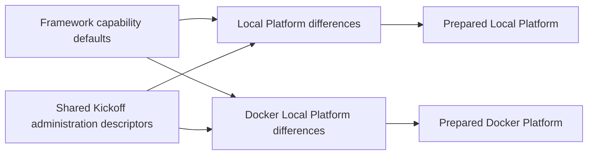

# Keep Kickoff configuration small

Kickoff inherits tested framework defaults. Its environment and server files
hold deployment choices and intentional differences. Shared customer
administration descriptions live once in `kickoffAdministration`, selected only
by the two Platform runtimes. Customers can change their applications without
maintaining copies of framework behavior.

For a beginner, start with the existing Local Platform example below and change
one value. Read the resulting prepared configuration before adding another
override; do not copy a complete framework file as a starting template.

## Business outcome

A business administrator chooses which applications to prepare and which
approved packages to install. Developers maintain those customer choices once;
operators maintain the actual deployment connections. Inherited defaults reduce
the settings a partner must learn while retaining explicit control over imports,
publication and reset operations.

## Understand the ownership before editing

| Concern | Kickoff location | What stays inherited |
| --- | --- | --- |
| Shared project administration profiles | `modules/kickoffAdministration/config/properties.js` | BackOffice orchestration, permissions, validation and imports |
| Local Platform transport and local-only profile differences | `envs/kickoffLocal/platformServer/config/properties.js` | Shared customer descriptors and capability defaults |
| Docker Local Platform differences | `envs/kickoffDockerLocal/platformServer/config/properties.js` and its existing topology contributions | Shared customer descriptors and framework behavior |
| Local environment policy | `envs/kickoffLocal/config/properties.js` | Generic CORS cache duration and other unchanged capability defaults |
| Docker environment policy | `envs/kickoffDockerLocal/config/properties.js` | Generic defaults, with Docker-specific origins and headers retained |
| Customer commerce policy | Local/Docker Commerce and Commerce Staged properties | Neutral framework behavior; the actual Agora store remains explicit |
| Circa application policy | `modules/circa.ewaste/config/properties.js` | Waste, Profile, Location and BackOffice authorities |

The shared administration module owns descriptors common to Local and Docker
Local, including application identity/presentation, equal data-package lists
and shared activation selections. It contains no deployment target, credential,
project root or port. It neither starts a server nor performs installation.
Its metadata declares only `configuration` and `llm` ownership; it does not
extend WCMS, Commerce or another functional group.

`runtimeModule: true` permits nConfig to load this selected configuration
boundary. That is different from an independently running service.
`runtimeModule: false` would exclude its properties from runtime inheritance.
Foundation's nTooling and nSetup are non-runtime packages with separate tooling
and governance entrypoints; their properties are not automatically inherited
by extending Foundation.



## Why the ordering matters

The module uses index `950.10`, before the project at `1000.00`, Local environment
at `1001.10` and Docker Local environment at `1001.20`. Their Platform server
layers follow. This makes the shared values defaults and preserves deployment
overrides. Both Platform `activeModules.modules` lists explicitly select
`kickoffAdministration`; other runtimes do not select it.

The normal nConfig loader remains authoritative. There is no additional loader,
profile registry, deployment process or project lifecycle script. Existing
Circa and other later-loaded contributions retain their own merge behavior.
An index change must be reviewed against the effective module order rather than
assumed safe from a directory name.

## Start with the smallest change

For Local employee browser sessions, the server needs only its intentional
local policy:

```js
profileBrowserSession: {
    enabled: true,
    secure: false,
    sameSite: 'Lax'
}
```

Cookie names, cookie paths and maximum age come from Profile. These are local
settings; do not copy `secure: false` into a production environment. Docker
keeps its distinct cookie names so Local and Docker browser sessions remain
separate.

For a Product catalogue limit, add only the value you intend to change under
an already active Commerce server:

```js
product: {
    discovery: { catalogue: { maximumCandidates: 800 } }
}
```

Omitting `maximumCandidates` uses Product's default. Other Product values do not
need to be copied. Changes to query budgets require performance review against
the intended catalogue size.

## Customize and extend safely

To change a shared application description, edit the matching profile in
`modules/kickoffAdministration/config/properties.js`. To change a deployment
connection, edit that environment's Platform profile target. For example, a
Local-only timeout override is:

```js
backofficeApplicationInitialization: {
    profiles: {
        nexus: { target: { timeoutMs: 60000 } }
    }
}
```

Merge this difference into the existing Local Platform properties. Do not
replace the entire file or copy this target into the shared module. The profile
continues to inherit its description and package selections; Docker retains its
own target values. A node override can further specialize this scalar through
the existing selected-node configuration chain.

When adding a new application, first decide whether its descriptor belongs to
an already active application module or to administrative composition. Prefer
the application owner where it can contribute without activating unrelated
capabilities. Keep shared cross-application administration data here only when
that is the appropriate selected consumer. Local-only profiles remain Local
choices; identical data is shared only where both environments intend it.

When adding a new environment or server:

1. Follow the framework module-generation contract and choose a unique ordered
   index; do not copy an existing server's complete properties.
2. Declare actual composition, coordinates, authority and required deployment
   inputs.
3. Select shared administration defaults only for an administrative runtime
   that consumes them, and put its override layer after the defaults.
4. Add only intentional differences, then run preparation and focused checks.
5. Test an unselected runtime to ensure that it does not gain application
   profiles or functional modules accidentally.

## Preserve arrays and operational safeguards

Current nConfig merges arrays by position. A shorter override can retain
inherited trailing entries; an empty array is not a general removal instruction.
This migration shares a list only when the complete values match. Deployment
lists that differ remain explicitly owned at their boundary. Use an existing
capability-specific removal mechanism where available and verify the effective
result before changing an activation or reset inventory.

Local reset opt-in, its environment allowlist and explicit model service lists
remain Local configuration. Shared defaults do not enable Docker Local reset.
Provider sandbox restrictions and deployment-selected model names remain
explicit where they represent intentional operator policy. Data descriptors do
not themselves execute imports, grant permissions, approve Online publication
or change tenant authority.

Large remaining blocks are not automatically framework defaults: deployment
knowledge-source bindings, transport targets, local-only application profiles
and reset inventories can carry real customer or server choices. Their ownership
must be assessed individually. A shorter entry file that imports the same large
payload does not reduce customer maintenance by itself.

## Send store context explicitly

Cart and Shopping List no longer select a store from `customerApi.defaultStoreCode`.
The obsolete Cart fallback declarations have been removed from Local and Docker
Local Commerce/Commerce Staged configuration. Store identity remains customer-owned;
the existing Agora commerce client sends its configured store explicitly for Cart
creation and Shopping List operations.

Before upgrading other callers, make them send `storeCode` through their existing
request payload/query or service context. All supplied values must agree. Missing,
malformed or conflicting context is rejected; no neutral or sample store is invented.
There is no new configuration layer or store-specific API. Other application-level
store selections used by Product publication or other capabilities have independent
owners and are not removed by this change.

Existing explicit-store ID formats and persisted records are preserved. Keep saved
Cart IDs, including any produced by the older context-only hashing bug; recomputing
a new hash is not a migration. Missing/inconsistent stored context needs governed
repair. Identifier validation is not a Store master lookup or an authorization grant.
Re-run prepared Commerce compositions and real client acceptance before deployment.

## Verification before operating

From the Kickoff repository:

```sh
node --test test/configurationInheritanceContract.test.js test/guidedInitializationProfilesContract.test.js test/communicationActivationDataContract.test.js test/dockerLocalEnvironmentContract.test.mjs
node test/runtime-prepare.test.js
node test/dockerLocalRuntimePrepare.test.js
npm run docs:generate
npm run docs:check
```

The configuration contract checks selection scope, index order, inherited
profile identity, environment-owned transports, a later node override and reset
boundaries. Existing runtime preparation checks use real nConfig resolution for
Local and Docker Local. Declaration tests compose the shared defaults instead
of assuming that a server file contains its entire effective configuration.

For this refactor, complete before/after preparation comparisons covered nine
Local and ten Docker Local runtimes across five domain selections: all, none,
Apparel, Electronics and Telco. These 95 comparisons preserved effective values
and the original module ordering. The deliberate graph change is the additional
configuration module on the two Platform runtimes. These checks prepare configuration and metadata; they do not
start listeners, reset databases, import packages or prove signed-in browser
behavior. Re-run the relevant operational journey after deploying/restarting
changed source through the usual project procedure.

## Common mistakes, troubleshooting and rollback

| Symptom | Check | Recovery |
| --- | --- | --- |
| Platform profile identity or package list is missing | Is `kickoffAdministration` selected and ordered before the environment? | Restore its selection/index; run preparation. |
| A target is missing | Does the selected environment still declare its profile transport? | Restore that environment's target; shared defaults intentionally do not supply it. |
| A Local setting appears in Docker | Was deployment data placed in the shared module? | Move it back to the appropriate environment and compare both runtimes. |
| An extra array item remains | Did a shorter array merge preserve a trailing entry? | Use supported removal semantics and inspect the effective list. |
| An unrelated server exposes shared profiles | Was the module selected by a common group or every server? | Restore Platform-only selection and run the unselected-runtime check. |
| Structure audit reports unrelated Circa gaps | Compare with the recorded baseline and inspect the owning work. | Keep those findings separate; do not overwrite ongoing Circa changes. |

Rollback restores the previous declarations and removes the shared-module
selection together. Re-run preparation before restarting. Do not revert
unrelated Circa, content, initialization or framework documentation changes.

Continue with the Customer Customization Guide for application extension and
the Local Runtime guide for deployment composition. The framework's permanent
rule is `nSetup/llm/contracts/customer-config-classification-contract.md` in the
resolved Foundation package.

## Commands and capability inventories

The framework supplies shared tooling operations. This project's
`nodics.project.json` supplies its actual server/environment aliases and declares
application-specific scripts under `scripts/acceptance`. For example,
`acceptance:agora-commerce` launches the project-owned customer journey through
the shared executor. Moving ownership does not authorize executing that journey:
its existing credential, import, startup and destructive confirmation gates apply.

The shared documentation generator reads this project's `docs/catalogue.json`
publication metadata. Record/code prefixes and routes are stable persisted
identifiers; changing them requires an explicit content migration. Labels and
channels remain application choices. A different project supplies its own values
without editing framework source.

Local reset definitions select capability inventories through
`localResetProvider.modules`. Each capability contributes its own model service
names; adding a contribution never enables reset. Servers retain their environment
allowlist, required model checks, confirmation and explicit search projections.
A later `serviceOverrides` false entry removes an optional inherited service.
Removing a required service fails before mutation. Explicit optional service names
for unavailable or historical models remain visible until their owners are selected
or their cleanup requirements are retired. No reset is implied by configuration
preparation or validation.

Foundation initialization profiles continue selecting their declared Init/Core
categories and destination roles. Release discovery and manifests determine each
capability's records; application bundles and captions remain project choices.

## Declarative environment selection

Local and Docker server properties export data. nConfig resolves explicit
`$config` bindings during the normal contribution sequence: the environment
profile owns Agora domain selection; environment properties own shared values;
server properties own runtime composition and isolated database names. Docker
endpoint references reuse `configurationValues.remoteEndpoints`; database owners
reference the server's default connection. Security settings are declared once
in the Docker environment, with secret values supplied through environment
bindings. No project runtime-properties builder remains.

Use `test/helpers/configuration.js` only in tests to invoke the real nConfig
loader without starting resources. Runtime startup continues to use nConfig
directly. Directly requiring properties observes declarations, including bindings.
Domain tests cover empty and reordered selections in both environments.
