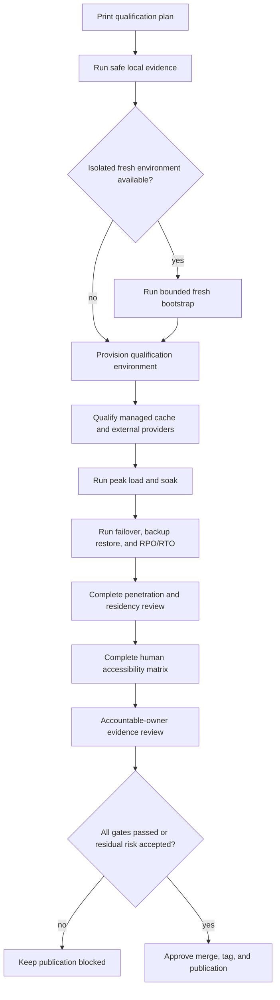

# Deployment qualification

Deployment qualification is the bridge between a release candidate that works
locally and a release that accountable owners may approve for production. The
Kickoff runner coordinates evidence from the framework, reference project,
Axis, and local Redis, but it deliberately cannot approve production by itself.

## Start here

From `nodics.kickoff`, print the plan without running anything:

```bash
npm run qualification:deployment
```

The JSON plan identifies each gate, its owner, the command that would run, and
what it proves. It contains no credentials or provider URLs.

Run the safe local gates:

```bash
npm run qualification:deployment:local
```

The runner executes the strict framework release gate, retained-data Kickoff
acceptance, Axis verification, and the live Redis cache and distributed
registry contracts. It writes sanitized evidence to:

```text
envs/kickoffLocal/generated/deployment-qualification/latest.json
```

The generated report is local operational evidence and is intentionally
ignored by Git. Archive it in the deployment system that owns the release.

## Fresh bootstrap is intentionally separate

Fresh acceptance drops only the documented Kickoff local databases. Because it
mutates local data, it is never included by default:

```bash
npm run qualification:deployment:local -- --include-fresh
```

Never use this flag against a shared development, qualification,
pre-production, or production database. Use an isolated disposable Kickoff
environment and verify the configured database names first.

## What local evidence does and does not prove

| Gate | Local proof | Still required before production |
| --- | --- | --- |
| Framework | Clean build, generated contracts, governance, dependency audit, and automated suites | Deployment-image and target-runtime confirmation |
| Kickoff | Integrated runtime, documentation, lifecycle, and business-user smoke journey | Production topology and operational ownership |
| Axis | Formatting, lint, type safety, automated tests, and production bundle | Supported browser/device and human assistive-technology matrix |
| Redis | Real local cache and distributed-registry behavior | Managed TLS/authentication, topology, isolation, failover, and recovery |
| Payments/providers | Mock and offline contract behavior | Real non-production credentials, callbacks, failure handling, and rollback |

Local success must never be translated into `productionApproved: true`. The
report fixes this value to `false` and keeps every external evidence class at
`NOT_EXECUTED`.

## Production-only evidence register

Named owners must attach evidence for all applicable rows:

| Evidence | Accountable owner | Minimum completion evidence |
| --- | --- | --- |
| Peak load | Performance owner | Workload model, dataset, topology, p95/p99, throughput, error rate, saturation, queue age, projection lag, and integrity reconciliation |
| Soak | Operations owner | Sustained duration, memory/CPU trends, retry growth, drift, storage/index growth, and post-run reconciliation |
| Penetration | Security owner | Authenticated attack surface, tenant isolation, validation, replay, export, webhook, and privilege-escalation results with disposition |
| Managed cache failover | Platform owner | TLS/authentication, topology, tenant isolation, node/provider loss, recovery time, and data-consistency results |
| Backup and restore | Data owner | Backup identity, restore procedure, authoritative counts/hashes, projection rebuild, and reconciliation |
| Regional residency | Infrastructure and privacy owners | Allowed-region routing, evacuation, deletion propagation, and cross-region leakage results |
| RPO/RTO | Operations owner | Measured recovery point and recovery time compared with approved objectives |
| External providers | Provider owners | Credential source, consent, callbacks, residency, observability, degraded behavior, rollback, and key rotation |
| Accessibility | Product accessibility owner | Keyboard, screen reader, zoom/reflow, contrast, browser, and supported-device results |

## Recommended execution order



Run functional success paths before destructive resilience tests. Run load
before failover only when the test plan explicitly needs a stable baseline.
Restore the environment and reconcile data after every destructive exercise.

## Failure and recovery

The runner continues through local gates so one report shows every attempted
check. Any non-zero command becomes `FAILED` with a stable failure code; raw
environment variables and secrets are excluded. Investigate the owning
repository first, rerun the focused failing command, then rerun the pack.

If Redis is unavailable, start or configure an approved test endpoint and set
`NODICS_CACHE_REDIS_URL` only in the execution environment. Do not commit it.
If the framework, Axis, or Kickoff checkout lives elsewhere, provide
`NODICS_QUALIFICATION_FRAMEWORK_ROOT` or `NODICS_QUALIFICATION_AXIS_ROOT`.

## Customization boundary

The runner implementation belongs to framework tooling. The project owns only
the qualification facts exposed through `nodics.project.json`: repository
coordinates, environment identity, local gate choices, and evidence policy. A
generated customer project should reuse the framework runner through project
commands and change only its manifest facts while retaining the safety
properties:

- dry plan by default;
- destructive checks explicitly opted in;
- no secrets or provider URLs in reports;
- external evidence remains separate from local automation;
- no automatic production approval;
- named owners and measurable completion criteria.

Do not move customer workloads, credentials, acceptance data, or risk decisions
into `nodics.ai`. Framework modules own reusable contracts and orchestration;
the customer project owns its environments, qualification targets, and release
decision.

## Common mistakes

- Treating local Redis as proof of a managed Redis topology, TLS, authentication,
  failover, or regional recovery.
- Calling mock Stripe or offline provider contracts a live-provider test.
- running `--include-fresh` without checking that the target is the isolated
  Kickoff local environment;
- publishing the generated JSON as a production approval even though it records
  only command outcomes and fixes `productionApproved` to `false`;
- pasting secrets, bearer tokens, provider URLs, customer data, or raw security
  findings into a shared evidence report;
- accepting average latency while ignoring p95/p99, errors, saturation, queue
  age, projection lag, and post-run data integrity;
- running failover or restore exercises without a rollback plan and named
  operational owner;
- letting Axis automation replace keyboard, screen-reader, zoom, contrast, and
  supported-device testing by a qualified human;
- merging or tagging merely because local gates passed while production-only
  evidence still says `NOT_EXECUTED`.

## Verification

Developers can verify the runner contract without starting the full stack:

```bash
npm run test:qualification
npm run qualification:deployment
```

Confirm the plan contains five non-destructive local gates, nine explicit
external gates, no environment values, and `productionApproved: false`. Then
run `npm run qualification:deployment:local` in the prepared local workspace.
Confirm every attempted local gate is `PASSED`, the report is written only
under the ignored `envs/kickoffLocal/generated` path, and all production-only
gates remain visible.

Operators should archive the local report with the immutable repository commit
identifiers, deployment image identifiers, environment name, external test
reports, and accountable-owner decisions. Before approval, independently
confirm that each external result belongs to the same release candidate and
environment topology. A missing, stale, differently scoped, or unverifiable
artifact remains pending; silence is never a pass.
