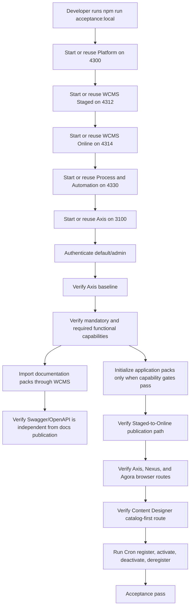
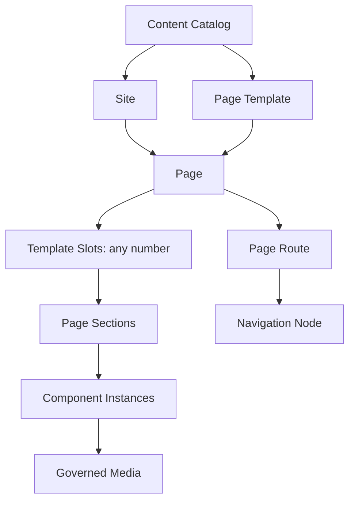

# Local Acceptance Checklist

This checklist is the beginner-friendly path for proving a fresh Nodics local
installation from zero database state. Use it when you have cloned the
framework, the Kickoff customer project, and the frontend workspace, configured
Kickoff, and want to confirm the backend framework, customer project, Axis,
Nexus, and Agora are working together.

The checklist is intentionally explicit. A new developer should be able to
follow it without already knowing Nodics module loading, BackOffice bootstrap,
WCMS content packs, or functional-module registration.

From a business perspective, this checklist proves that a new team can start
the reference project, import governed data, open Axis, inspect documentation,
and see public/customer-facing surfaces without first designing a production
topology. It gives decision makers a visible adoption proof and gives
developers/operators the command evidence needed to repeat or diagnose the
same setup.

## What this checklist proves

The acceptance run proves six things:

| Area | What must be true |
| --- | --- |
| Framework checkout | Kickoff can resolve Core, Platform, WCMS, and Process from the configured framework root. |
| Runtime topology | Platform, WCMS, and the composed Process and Automation runtime can start from the Kickoff local environment. |
| Bootstrap data | Mandatory initialization data can be imported from module-owned releases. |
| Axis access | Axis can connect to Platform, authenticate the local admin, and discover BackOffice bootstrap data. |
| Module lifecycle | Core, Platform, and WCMS are mandatory/registered; Process is observable as an optional runtime module with workflow and cronjob technical modules. |
| Application readiness | Nexus and Agora setup is blocked until the required business capabilities are registered, active, imported, approved, and visible through Online delivery. |

If any one of these fails, do not continue adding new functional modules. Fix
the contract break first, otherwise every later module will inherit a shaky
local foundation.

## Repository layout used by the reference run

The local reference setup normally looks like this:

```text
nodicsRoot/
  nodics.ai/
  nodics.kickoff/
  nodics.exp/
    nodics.axis/
    nodics.nexus/
    nodics.agora.apparel/
```

This layout is only a convenience. Customer projects may live anywhere. The
important contract is that `nodics.kickoff/.env` tells Kickoff where the
framework checkout lives.

```dotenv
NODICS_FRAMEWORK_ROOT=../nodics.ai
```

Use an absolute path if your repositories are not parallel:

```dotenv
NODICS_FRAMEWORK_ROOT=/Users/example/projects/framework/nodics.ai
```

## Mandatory prerequisites

Before running the checklist, confirm these local services and tools are
available:

1. Node.js 24 and npm.
2. MongoDB running locally.
3. The required repositories are cloned:
   - `nodics.ai`
   - `nodics.kickoff`
   - `nodics.exp` with `nodics.axis`, `nodics.nexus`, and Agora applications
4. `nodics.kickoff/.env` exists and points to the framework root.
5. `nodics.exp/nodics.axis/.env` points to the local Platform server.

Run this from `nodics.kickoff`:

```bash
cp .env.example .env
npm install
```

Run this from `nodics.exp/nodics.axis`:

```bash
cp .env.example .env
npm install
```

## Fresh schema reset

No contributor, AI agent, test, migration, or acceptance script may read or
mutate Nodics databases directly. A fresh-schema run must use the governed
Platform Local reset API/service with authorization, audit, explicit runtime
targets, and recovery evidence. Never substitute a database shell command.

Before running `acceptance:local:fresh`, stop any existing local topology owned
by this checkout. The command refuses to reset while Platform, WCMS, Process,
Engagement, Commerce, Axis, Nexus, or Agora are still listening from another
process.

## Fresh-schema user journey

Use this order when the database is empty and the user wants Axis, Nexus,
Agora, and documentation to work from a clean state.

| Order | User action | Required evidence before moving on |
| ---: | --- | --- |
| 1 | Start the local topology from `nodics.kickoff`. | Platform, WCMS Staged, WCMS Online, Process, Engagement, Commerce, Axis, Nexus, and Agora are reachable on their configured local ports. |
| 2 | Open Axis and complete the empty-database Axis setup. | Axis baseline, BackOffice navigation, Profile admin access, and CMS baseline are initialized through governed APIs. |
| 3 | Open Module Registry and register/activate required capabilities. | Core, Platform, and WCMS are mandatory and active. Agora setup requires Commerce and Discovery. Nexus setup requires its public content capability and any enabled engagement capability. |
| 4 | Open Setup and Accelerators. | Rows clearly show whether each application is ready, blocked by missing capabilities, waiting for approval, published Online, or already current. |
| 5 | Initialize Nexus or Agora packs only after required capabilities are ready. | The import includes CMS pages, routes, navigation, media records, physical media artifacts, commerce catalog data, search/discovery data, and operational data owned by the selected pack. |
| 6 | Publish to Online through the same screen or approval queue. | Staged changes are reviewed, approved or rejected by an authorized user, then promoted to Online with audit evidence. |
| 7 | Verify public applications in the browser. | Nexus and Agora render Online content. If Online content is absent, they show a customer-friendly maintenance page, not hardcoded demo content. |

Documentation has a parallel lane. Framework, Axis, and Kickoff documentation
packs can be imported and approved while application setup is in progress.
Documentation publication controls documentation pages only. It must not hide
Swagger/OpenAPI, because Swagger/OpenAPI is generated from active backend
contracts rather than CMS documentation content.

## Automated acceptance path

Most maintainers should use the automated path first. It proves the same
contracts as the manual checklist and reduces human mistakes during repeated
bootstrap tests.

Use the non-destructive API-only form:

```bash
npm run acceptance:local
```

This checks the running or newly started split WCMS topology and imports
missing releases only through Nodics APIs. `acceptance:local:fresh` first
performs the governed Platform Local reset and then proves the clean bootstrap
path through the same APIs and browser-facing contracts.

### What the automated command proves



The command stops the servers it started after the acceptance gates complete.
To keep the API-qualified stack running, use:

```bash
npm run acceptance:local -- --leave-started
```

The command does not inspect or mutate a database directly, kill unrelated
processes, or create another importer. It uses the existing Profile login, BackOffice registry,
WCMS content-pack API, and Axis smoke test. This matters because acceptance
must prove the same path a real developer or operator uses.

## Start and stop the complete Local topology

The normal direct-Node workflow is supervised from one terminal:

```bash
npm run topology:start
```

This starts Platform, WCMS Online, Process, WCMS Staged, Engagement, and
Commerce in dependency-aware order. It waits for each low-disclosure readiness
endpoint before starting the next runtime and writes generated logs and PID
ownership beneath `envs/kickoffLocal/generated/local-topology`.

To include Axis, Nexus, and Agora frontend applications from the local
`nodics.exp` workspace:

```bash
npm run topology:start:all
```

From another terminal, inspect readiness and ownership:

```bash
npm run topology:status
```

Stop only the topology owned by this checkout:

```bash
npm run topology:stop
```

The stop command validates the recorded supervisor PID and command before
sending a signal. A busy port without matching ownership is reported as
`EXTERNAL_OR_UNKNOWN` and is never killed. Ctrl+C in the supervisor terminal
performs the same bounded reverse-order graceful shutdown.

## Start individual backend servers

For focused debugging, open separate terminals from `nodics.kickoff`.

Terminal 1:

```bash
npm run start:platform
```

Terminal 2:

```bash
npm run start:wcms:staged
```

Terminal 3:

```bash
npm run start:wcms:online
```

Terminal 4:

```bash
npm run start:process
```

Expected local ports:

| Runtime | Port | Why it matters |
| --- | ---: | --- |
| Platform | 4300 | Profile login, BackOffice bootstrap, module registry, OpenAPI discovery. |
| WCMS Staged | 4312 | Versioned CMS authoring, imports, validation, and publication source. |
| WCMS Online | 4314 | Published CMS delivery and authenticated publication target only. |
| Process and Automation | 4330 | Process/workflow APIs plus optional Cron observation and registry lifecycle testing. |

If a port is already in use, confirm whether it is an earlier Nodics server
from the same checkout. Do not kill unrelated processes by guessing.

## Start Axis

Open another terminal from `nodics.exp/nodics.axis`:

```bash
npm run dev
```

Axis should be available at:

```text
http://localhost:3100
```

## Login

Open Axis and use the local reference credentials:

```text
Enterprise: default
Login ID: admin
Password: adminPassword
```

Successful login proves:

1. Axis can load public bootstrap from Platform.
2. Profile can authenticate the local admin.
3. Axis can retrieve authenticated BackOffice bootstrap data.
4. Axis receives authorized navigation and runtime module projections.

## Import initialization data

In Axis, open the import/initialization workspace and install the available
initialization releases.

You should see releases owned by active modules only. The system must not ask
Axis to invent import data. Axis presents the operation; the owning backend
module and nImport execute the import.

Expected outcome:

- mandatory Profile/bootstrap identity data is available;
- core framework data required by Platform and WCMS is present;
- documentation content packs can be imported or updated;
- repeated import attempts with unchanged immutable releases do not corrupt
  existing data.

## Verify module registry

Open:

```text
System and Integrations → Module Registry
```

Expected state:

| Functional module | Expected state | Why |
| --- | --- | --- |
| `nodics.foundation` | Registered and active | Required by every runtime. |
| `nodics.platform` | Registered and active | Required for Profile, BackOffice, and Axis bootstrap. |
| `nodics.wcms` | Registered and active | Required for CMS, documentation, and media/content management. |
| `nodics.process` | Optional, observed when Process and Automation is running | Proves process/workflow capability can join the lifecycle. |
| Cron and scheduled automation | Technical capability under the Process runtime | Proves scheduled jobs can be discovered without creating a second scheduler authority. |
| Commerce | Required before Agora application packs can become usable | Provides catalog, product, cart, order, price, stock, and checkout capability for storefronts. |
| Discovery | Required before Agora application packs can become usable | Provides search/discovery readiness for product and content lookup. |
| Engagement | Required before Nexus engagement features can become usable | Provides public engagement APIs for corporate-site interaction features. |

Core, Platform, and WCMS are mandatory for this local Axis-backed acceptance
topology. They should not appear as removable optional modules. Cron may be
registered, activated, deactivated, and deregistered as an optional module.
Agora and Nexus setup must remain blocked until their required functional
capabilities are registered and active. A visible content pack is not enough.

## Verify documentation

Open:

```text
Documentation
```

Expected documentation products:

- Framework
- Swaggers
- Nodics Axis
- Nodics Kickoff

The products are intentionally separated by ownership:

| Documentation product | Owning repository/module |
| --- | --- |
| Framework | `nodics.ai/nodics.docs` |
| Nodics Axis | `nodics.ai/nodics.platform/modules/axis` |
| Nodics Kickoff | `nodics.kickoff` |
| Swagger/OpenAPI | Platform BackOffice/OpenAPI contracts |

Axis is only the renderer. It must not own backend-importable documentation
content. Documentation packs can be imported, approved, and published in
parallel with application setup. Swagger/OpenAPI should remain visible whenever
the authenticated runtime exposes generated OpenAPI contracts, even if CMS
documentation packs are not yet published.

## Verify application setup and Online delivery

Open:

```text
Setup and Accelerators
```

Expected behavior:

- Axis shows each application as a compact row with clear status, required
  capabilities, next action, refresh, and expandable detail.
- A row is **blocked** when a required capability is not registered, inactive,
  unavailable, or offline. The next action should point the user to Module
  Registry instead of allowing a misleading import.
- Agora Apparel, Agora Electronics, and Agora Telco require Commerce and
  Discovery before their application packs can become usable.
- Nexus requires the public content capability and any enabled engagement
  capability before its public site pack can become usable.
- Initializing an application pack must prepare the complete site, not only a
  small metadata record: CMS content, routes, navigation, media records,
  physical media artifacts, commerce catalog/search data where applicable, and
  operational data owned by the pack.
- Public frontends consume Online only. Before approval and publication they
  show the maintenance page. They must not render hardcoded sample data from
  the frontend repository.

## Verify content and media

Open these Axis routes:

```text
/content
/content/designer
/media
/media/items
/media/folders
```

Expected behavior:

- `/content` shows the content dashboard and WCMS-owned summary sections.
- `/content/designer` shows the governed Page Designer foundation. It should
  explain the catalog-first sequence and support dynamic template slots rather
  than assuming a fixed header/main/footer page shape.
- `/media` shows media management, media records, and media-by-source sections.
- `/media/items` and `/media/folders` open focused media workspaces instead of
  falling into CMS recovery.
- Any unavailable backend schema is reported as a backend/schema discovery
  issue, not as a frontend-owned data model.

### Verify Page Designer authoring model

Open:

```text
Content and Experience → Web Content Management System → Page Designer
```

The Designer is not expected to look exactly like the final website in a
browser. It is the authoring and structure view. A beginner should understand
this chain:



This acceptance step proves only that the reference local stack can consume the
WCMS-owned authoring model. The contract itself belongs to WCMS. If the
Designer metadata is wrong, fix the owning WCMS contract and tests first; do
not move catalog, site, template, slot, page, component, or media authority
into the reference project or into the Axis frontend.

Expected Designer evidence:

| Area | Expected behavior |
| --- | --- |
| Catalog-first sequence | The UI starts from content catalog, then site, template, page, slots, sections, components, media, route, and navigation. |
| Dynamic slots | Slot names come from template data; the UI must not assume only three slots. |
| Backend authority | Save/validate actions call WCMS/CMS authoring APIs, not browser-local persistence. |
| Media governance | Media association points to nMedia records or sets; it never asks for a filesystem path. |
| Publish readiness | Designer can validate readiness, but publishing remains CMS/nPublish authority. |

If Designer loads but cannot validate or save, inspect the WCMS server first:
`cmsAuthoring` API exposure must be enabled, the user must have
`cms.backoffice.manage`, the selected Site must belong to the selected Content
Catalog, and the selected Template must expose the slots being edited.

## Verify Cron

Open:

```text
/cron
```

Expected behavior:

- If Process and Automation is running, Axis can observe the Process
  functional module and the CronJob technical capability from the same runtime.
- If Cron is not registered, it appears as available to register.
- Register moves it into the registered list without requiring a page refresh.
- Activate changes lifecycle state without freezing buttons.
- Deactivate and deregister return it to the correct next state.

The automated acceptance runner performs the full optional Cron lifecycle:

```text
available → register → registered/inactive → activate → registered/active
registered/active → deactivate → registered/inactive → deregister → available
```

Cron is optional for the project, so the final accepted state after the
automated lifecycle test is **available** rather than permanently registered.
That proves both the runtime observation path and the governed removal path.

If an action succeeds but the UI does not update, inspect the module registry
API response immediately after the action. The frontend should refresh local
query state after each lifecycle operation.

## Command-line smoke test

After the servers and Axis are running, use the live smoke script from
`nodics.exp/nodics.axis`:

```bash
AXIS_EXPECT_MODULES=1 npm run smoke:live
AXIS_EXPECT_MODULES=1 AXIS_EXPECT_DOCUMENTATION=1 npm run smoke:live
AXIS_EXPECT_MODULES=1 AXIS_EXPECT_DOCUMENTATION=1 AXIS_CRON_LIFECYCLE=1 npm run smoke:live
```

Expected result:

```text
PASS Axis route /
PASS Axis route /content
PASS Axis route /content/designer
PASS Axis route /media
PASS Axis route /media/items
PASS Axis route /media/folders
PASS Axis route /cron
PASS Axis route /system-integrations
PASS Axis route /registry
PASS Axis route /operations/imports-exports
PASS Axis route /docs/swaggers
PASS BackOffice public bootstrap
PASS authenticated login for admin
PASS module registry reachable
PASS required modules registered: nodics.foundation, nodics.platform, nodics.wcms
PASS optional runtime modules observed: nodics.process
PASS documentation pack nodicsDocumentation is CURRENT
PASS documentation pack axisDocumentation is CURRENT
PASS documentation pack kickoffDocumentation is CURRENT
PASS cron lifecycle register
PASS cron lifecycle activate
PASS cron lifecycle deactivate
PASS cron lifecycle deregister returns module to available
```

## Troubleshooting quick map

| Symptom | Most likely boundary |
| --- | --- |
| Axis recovery says BackOffice registry unavailable | Platform server is not reachable or Axis points at the wrong Platform URL. |
| Login fails | Profile data was not imported, credentials changed, or Platform is using a different database. |
| Documentation route shows CMS recovery | WCMS is down, documentation pack is not imported, or the documentation source is not registered. |
| Import page says API category is disabled | API exposure defaults belong in owning modules; check whether the runtime disabled the category at server level. |
| Process does not appear | Process and Automation server is not running, or the runtime has not reported its functional module observation. |
| Module action succeeds only after refresh | Axis query invalidation or backend response envelope needs review. |
| Media schema discovery unavailable | WCMS/media runtime is not exposing the expected schema workbench contract. |

## Acceptance sign-off

The local acceptance run is complete when:

1. Platform, WCMS, Process and Automation, and Axis are running.
2. Required releases were qualified through Nodics import/publication APIs.
3. Admin login works.
4. Module registry shows mandatory modules and optional Cron correctly.
5. Documentation products are visible.
6. Content and media routes render the expected workspaces.
7. The Page Designer route shows the catalog-first model and does not invent a
   fixed slot shape or frontend-owned content persistence.
8. `npm run acceptance:local` passes, or the manual equivalent plus
   `AXIS_EXPECT_MODULES=1 AXIS_EXPECT_DOCUMENTATION=1 AXIS_CRON_LIFECYCLE=1 npm run smoke:live`
   passes.
9. No repo in the three-repo set has uncommitted acceptance changes.

When all nine are true, the modularized foundation is ready for the next
functional module.

## Common mistakes

- Treating a running Node process as proof that the customer project is ready.
- Skipping content-pack import and then wondering why Axis documentation or
  WCMS pages are unavailable.
- Reading, dropping, or modifying a database directly during a test instead of
  using an authorized Nodics API/service.
- Accepting a module lifecycle flow that requires a browser refresh after
  register, activate, deactivate, or deregister.
- Ignoring an `INVALID RELEASE` message because the release still appears in
  the list.
- Verifying only Platform while forgetting WCMS, documentation, media, Process,
  Cron, and Axis routes.

## Verification

Run the API-only checklist repeatedly when confidence matters. The expected
result is idempotent release qualification, mandatory module visibility,
optional Cron lifecycle handling, fresh-schema reset through the governed
Platform Local reset API, and Axis rendering without manual database inspection
or edits.

For project documentation changes, regenerate the Kickoff documentation pack,
run the documentation contract test, start Platform and WCMS, import or update
the Kickoff docs release, and open `/docs/nodics-kickoff` in Axis. If the page
only works because it was hardcoded in the frontend, the acceptance result is
not valid.
