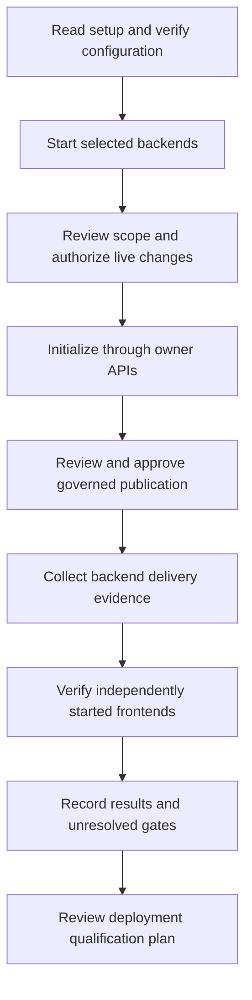

# Local Acceptance Checklist

Use this page to verify the Kickoff reference customer project on a developer
machine. It connects setup to evidence: configuration checks first, authorized
backend initialization next, and frontend verification separately. It is not an
executable test, a second definition of framework rules, or production approval.

## Choose your path

For beginners, start with the setup runbook and return here for verification.
Do not run every command at once: complete the non-live checks first, then ask
the environment owner before selecting a mutating journey.

| Audience | Start here | Continue when |
| --- | --- | --- |
| New developer or administrator | [Local setup to live runbook](local-setup-to-live-runbook.md) | The selected backends and independently started Axis frontend are reachable. |
| Backend developer | [Local runtime](local-runtime.md) and [configuration inheritance](configuration-inheritance.md) | Project validation and configuration-only preparation pass. |
| QA engineer | This checklist, then [functional journeys](functional-journeys.md) | Prerequisites are available and each result has scoped evidence. |
| Operator | [Local publishing operations](local-publishing-operations.md) | Import, approval, Online delivery and recovery evidence are understood. |
| Release owner or architect | [Deployment qualification](deployment-qualification.md) | Local results and outstanding external gates are recorded separately. |

Read these source pages directly before any documentation pack is installed.
After governed publication, open Axis Documentation, select Nodics Kickoff,
then **Run Kickoff Locally > Local acceptance checklist**. Its catalogue group
is Acceptance and Verification. Search for the page title, local validation,
developer onboarding, QA, or setup verification. Related pages provide the
same reading path in the published documentation; source links support repository
readers without a running server.

## Prerequisites and authority


```mermaid
flowchart TD
  Source["Read setup and verify configuration"] --> Ready["Start selected backends"]
  Ready --> Review["Review scope and authorize live changes"]
  Review --> Init["Initialize through owner APIs"]
  Init --> Publish["Review and approve governed publication"]
  Publish --> API["Collect backend delivery evidence"]
  API --> Browser["Verify independently started frontends"]
  Browser --> Report["Record results and unresolved gates"]
  Report --> Release["Review deployment qualification plan"]
```

Install the declared project dependencies with `npm ci` from this repository.
Resolve the framework through the package dependency or supported explicit
framework-root configuration. Project identity comes from `package.json.name`;
environment and server choices come from their layered properties and package
metadata. Do not create a separate project descriptor or copy framework checks.

For live acceptance, provision the configured local providers and authorized
bootstrap identity. Inspect the selected environment before executing anything
that imports data, changes module lifecycle, approves a publication or resets
state. Do not put credentials in this page or attach tokens to evidence.

BackOffice owns bootstrap and capability discovery; nImport owns governed
imports; CMS, Process and nPublish own publication; functional modules own their
business APIs. Kickoff selects customer applications, fixtures and deployment
coordinates. The commands below delegate to those framework owners.

Backend validation needs neither a frontend checkout nor a frontend server.
Browser validation additionally needs Axis and each selected application,
installed and started in its own repository. Docker execution is a separate
qualification activity, not part of this Local checklist.

## Verification without live mutation

Run these from `nodics.kickoff` before starting a live acceptance journey:

```bash
npm run nodics:project:validate
npm run test:documentation
npm run test:qualification
npm run test:agora-commerce
npm run prepare:runtime
```

These check project adoption, generated documentation consistency, customer
fixtures and configuration graphs. Runtime preparation does not launch servers
or prove provider connectivity. Static container contracts in the qualification
tests do not execute or qualify Docker. A passing test command is evidence only
for the assertions it actually runs, not proof that every application works.

If documentation source changed, review the catalogue version and content path
before running `npm run docs:generate`, then rerun `npm run test:documentation`.
Stable release changes require a forward version and unused `core-vNNN` path;
never overwrite released bytes or repair generated CMS records by hand. Resolve
uncertain installed receipt/publication history before selecting a successor.
Source validation alone does not prove that updated pages are published Online.

## Start the selected local backends

Inspect and start the owned topology from this repository:

```bash
npm run topology:preflight
npm run topology:start
```

Keep the supervisor terminal open. From another terminal use
`npm run topology:status`; stop the owned backends with
`npm run topology:stop`. Preflight and readiness output identify the effective
runtime coordinates. Consult Local runtime for the reference ports rather than
assuming a copied address matches a customized environment.

Topology commands manage backends only. Start Axis and the required customer
frontends separately with `npm run dev` in each frontend repository. Backend
stop does not stop those frontend processes. Never kill an unrelated process
merely because it occupies a configured port.

## Authorized initialization and publication

Prefer retained-data acceptance when no reset is needed. The following command
is **mutating**: it can initialize selected data and approve governed publications.
Use it only with authorization for the selected isolated Local environment:

```bash
npm run acceptance:local -- --execute --approve-publications
```

The backends must already be running. To let the runner own their startup,
supply `--start-runtimes`; it cleans up its own children unless
`--leave-started` is also supplied. These flags do not start frontends.

For the focused guided initialization journey, review its prerequisites and use:

```bash
npm run acceptance:guided-initialization -- --execute --approve-publications
```

Both commands use normal authorized owner APIs. Neither gives permission to
bypass an unavailable approval task, manufacture publication evidence, grant
missing privileges, write directly to Online, or access a database directly.

A fresh run is optional and destructive to selected Local data. Review reset
scope and recovery evidence, stop the existing owned backend topology, and
confirm no other process is using its runtimes before invoking:

```bash
npm run acceptance:local:fresh -- --execute --approve-publications
```

The alias selects owned startup and the governed Platform Local reset. Never
run it against shared development or production data. A failed authorization,
readiness or reset receipt is a blocker, not permission for a database-shell
workaround. Ordinary documentation edits never require a reset.

That alias is a governed **record reset and automated acceptance** path, not a
physical all-schema rebuild or a browser-only import journey. For an explicitly
approved disposable Mongo/auth-state rebuild followed by Axis UI imports, use
the [native Local maintenance scope and stopped-stack sequence](local-runtime.md#disposable-native-local-rebuild).
Mongo-only drops can leave versioned auth state that correctly prevents startup.
Never erase shared Redis/search/Media or auto-clear security state at startup;
do not run this acceptance alias when the approved session requires UI imports.

## Versioned domain publication qualification

For Product, Pricing, Tax, Inventory, Promotion and Media, track these as separate
gates. A completed migration or passing unit suite does not establish Online
delivery. Reuse the owning framework commands, source services and normal Process
tasks; Kickoff supplies only the selected Local composition and application data.

1. Stop affected writers through the topology owner, retain a scoped backup, and
   review a fresh installed-version migration plan. Require completed owner
   journals, exact postimage checks and version-qualified unique indexes before
   enabling CURRENT source reads and reopening those writers.
2. Verify effective module selection, explicit source/target connections, runtime
   deployment grants and installed workflow versions. Publication authoring must
   activate the shared nPublish module; Process may discover declared remote
   callbacks without activating the business domains itself.
3. Capture exact source versions, validate, request approval, and complete the
   normal assigned Process task. Verify the committed target receipt and actual
   domain delivery, not only the publication status or a pending task reference.
4. Publish a successor, qualify retry with its existing identity, and roll it
   back through the governed lifecycle. Verify the recorded predecessor is
   delivered again. Preserve the operation identity after an uncertain response;
   do not create a replacement publication merely to hide a transport failure.

Publish catalogue, policy and configuration only. Stock balances, reservations,
allocations, coupon state and consumed budgets remain operational and must not
be restored by policy rollback. Media qualification also verifies retained bytes
and legal-hold behavior. Scope delivery selectors to the qualified roots; do not
enable unrelated readers on the strength of one fixture.

For a bounded Product rollout, select the owner activation reader and explicit
`product.discovery.activationScopes` tenant/store pairs in the existing Commerce
runtime-role profile. The Local qualification store is
`localProductQualificationStore20260929`; other stores retain their configured
delivery. Prove search and product detail before publication, after a successor,
and after rollback. A selected store with no activation must return no published
products, not fall back to unapproved catalogue data.

When reconciling one publication, send its explicit `publicationCode` to the
existing operations endpoint. Verify unrelated CMS outbox events remain unchanged.
Do not omit the code to work around a failure: omission requests a broader batch.
For an incomplete target operation, retain its publication, original operation
identity, failed workflow history and receipt. Use only the domain's documented
recovery path, then normal lifecycle retry and renewed approval as required;
neither a new successful fixture nor a manual revision edit proves recovery.

Record each domain as PASSED, FAILED, BLOCKED or NOT EXECUTED. Dated repository
evidence is maintained separately in `docs/evidence/final-ownership-audit.md` and
its JSON companion; earlier entries are historical, not current readiness claims.
Framework owner contracts remain authoritative for migration and retention rules.

## Manual setup and browser verification

Follow the screenshot-guided setup runbook for the actual UI actions. This
table defines the customer evidence to collect, not additional framework rules.

| Check | Required evidence |
| --- | --- |
| Backend readiness | Selected runtimes report ready through their own APIs. |
| Axis first launch | Authorized login works; a missing managed baseline is initialized and approved through the normal recovery workspace. |
| Capability availability | Required application capabilities are registered and active; blocked setup explains the missing owner prerequisite. |
| Data readiness | Selected module-owned releases report their expected installed version and checksum. |
| Publication | Staged validation, Process decision and Online receipt refer to the same release. Pending approval is not Online success. |
| Documentation | Kickoff pages are discoverable after pack publication; related pages open. Swagger remains an independent runtime API reference. |
| Application delivery | Selected Nexus, Agora or Circa journeys use their owning backend contracts; published routes, media and data are visible. |
| Frontend behavior | Each frontend passes its own checks and browser review; backend API success alone does not prove rendering or accessibility. |

Do not mark an approval-pending workspace as complete just because import passed.
Inspect the current task status, assignee, permissions and publication details.
Follow Local publishing operations for supported recovery; do not reopen or
replace workflow state through direct persistence changes.

## Record results and blockers

Record the date, repository commit and dirty-state identity, selected environment,
command with secrets removed, exit status, relevant release/checksum receipts,
and reviewer. Keep generated runtime reports under their existing ignored output
locations and retain sanitized evidence in the release or issue system.

Distinguish PASSED, FAILED, BLOCKED and NOT EXECUTED in the human report. A missing
provider, permission, owner API, domain publication adapter or funded test wallet
remains a named blocker. A test that reports partial acceptance is not full
qualification, even if some requests succeeded. Resolve the owning prerequisite
and rerun the affected gate before claiming completion.

Historical extraction results are preserved separately in
`docs/evidence/2026-09-28-acceptance-cleanup-history.md`. They are not a published
setup page, current readiness evidence, or instructions for a new deployment.

## Common mistakes

| Symptom | Check first | Next action |
| --- | --- | --- |
| Configuration check fails | Dependency resolution and selected environment | Fix the owning project contribution before live execution. |
| Backend port is busy | Topology PID ownership and status | Stop only a process you own; do not bypass admission checks. |
| Axis does not open | Axis frontend terminal | Start Axis independently and verify its configured backend. |
| Initialization is blocked | Required capability, authorization and release state | Resolve the owning prerequisite through governed APIs. |
| Publication stays pending | Process task state, assignee and decision permission | Review publication details and follow supported workflow recovery. |
| Checklist is absent in Axis | Kickoff documentation import and Online receipt | Read the repository page meanwhile; publish the selected pack normally. |

- Treating generated documentation, a running frontend, or a passing unit test
  as proof of a completed live application journey.
- Assuming backend topology launches Axis or the storefronts.
- Running mutating acceptance or fresh reset as a routine documentation check.
- Approving content without reviewing the target, version, checksum and workflow.
- Editing immutable/generated data or bypassing owner APIs to clear a blocker.
- Copying historical results into a new release report without rerunning checks.
- Treating this project guide as the source of reusable framework rules.

## Sign-off and next step

The developer and QA reviewer should be able to reproduce the selected journey,
explain every blocked or omitted capability, and associate results with the same
source and environment. The operator verifies the published release and recovery
evidence. Business reviewers verify the intended application outcome, not merely
a list of passing technical commands.

Proceed to Deployment qualification for a non-mutating plan:

```bash
npm run qualification:deployment
```

Review that plan before opting into its live gates. Production security,
performance, accessibility, real providers, backup/recovery and accountable-owner
approval remain separate. Local completion never authorizes production by itself.
