# Local Setup to Live Runbook

This runbook is the new-user golden path for making the Nodics reference stack
live on a developer machine. It starts from a local checkout, opens Axis, signs
in, follows the guided setup workspaces, publishes governed data to Online, and
verifies Nexus and Agora in the browser.

The normal-path screenshots show the current local reference UI. The
first-launch screenshots document the bundled recovery path from the current
Axis component contract because this captured environment already had Axis
baseline data. Recapture those first-launch images from a clean schema during
the next fresh acceptance run.

For beginners, the safe mental model is: start the stack, sign in to Axis,
follow the highlighted backend-owned setup cards, approve publication, then
open the public applications. Business users should read the status and next
action on each screen. Developers should use the file paths and commands when a
status points to a configuration, release, or module problem. Operators should
keep the command output, screenshots, and browser checks as setup evidence.

## What live means

In Nodics, live does not mean that a frontend server is running. A local setup
is live when these conditions are true:

| Area | Live condition |
| --- | --- |
| Backend topology | Platform, WCMS Staged, WCMS Online, Process, Engagement, Commerce, Axis, Nexus, and Agora are reachable on their local ports. |
| Axis control plane | The admin can sign in and the dashboard shows runtime, module, release, publishing, and application readiness. |
| Module foundation | Required modules are registered and active through backend-owned registry contracts. |
| Release data | Init, core, and sample releases are current or intentionally skipped by policy. |
| Application packs | Nexus and Agora accelerator packs have prepared Staged content and any required Commerce data. |
| Publication | Publishable content has moved from Staged to Online through approval and audit evidence. |
| Public verification | Nexus and Agora render Online content, navigation, media, and business data from backend contracts. |

## Repository layout

Use the reference layout unless your project already documents another one:

```text
nodicsRoot/
  nodics.ai/
  nodics.kickoff/
  nodics.exp/
    nodics.axis/
    nodics.nexus/
    nodics.agora.apparel/
```

`nodics.ai` is the framework checkout. `nodics.kickoff` is the reference
customer project and owns the local runtime composition. `nodics.exp` groups
frontend applications. Axis is the employee BackOffice, Nexus is the corporate
site, and Agora is the commerce storefront.

## Prepare the project

Run the first setup from `nodics.kickoff`:

```bash
cp .env.example .env
npm install
npm run nodics:project:validate
```

Review `nodics.kickoff/.env` and confirm the framework root:

```dotenv
NODICS_FRAMEWORK_ROOT=../nodics.ai
```

Run frontend setup from each frontend repository that will be opened:

```bash
cd ../nodics.exp/nodics.axis
cp .env.example .env
npm install
```

Repeat dependency installation for Nexus and Agora when their local
repositories have not been installed yet.

## Start the local stack

From `nodics.kickoff`, start the full local stack:

```bash
npm run topology:start:all
```

This starts backend runtimes and frontends in dependency-aware order. Use this
command when a new user wants to see the whole product work together.

Use this command from another terminal to inspect status:

```bash
npm run topology:status
```

The expected local URLs are:

| Surface | URL | Purpose |
| --- | --- | --- |
| Axis | `http://localhost:3100` | Employee setup and operations workspace. |
| Nexus | `http://localhost:3200` | Public corporate site using Online content. |
| Agora Apparel | `http://localhost:3300` | Public storefront using Online content and Commerce data. |
| Platform | `http://localhost:4300` | Profile, BackOffice, registry, and bootstrap authority. |
| WCMS Online | `http://localhost:4314` | Online public content runtime. |
| Process | `http://localhost:4330` | Workflow, approval, and automation runtime. |
| WCMS Staged | `http://localhost:4312` | Staged content authoring and import runtime. |
| Engagement | `http://localhost:4340` | Contact, review, feedback, and communication runtime. |
| Commerce | `http://localhost:4350` | Operational Commerce runtime. |
| Commerce Staged | `http://localhost:4352` | Staged Commerce catalog and storefront preparation runtime. |

Stop only the topology owned by this checkout:

```bash
npm run topology:stop
```

## First launch before Axis data exists

On a fresh schema, Axis may not show the managed CMS login immediately. This is
expected. Axis first falls back to a small bundled recovery login whose only
job is to authenticate the bootstrap operator and move the managed Axis
baseline through the governed release flow.

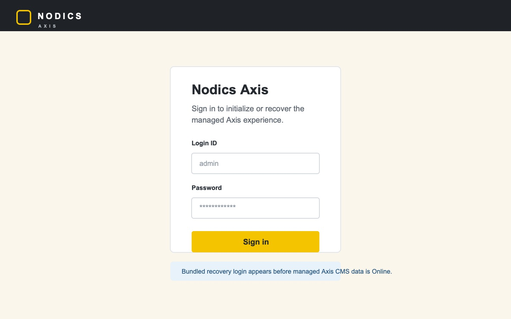

Use the local reference admin account:

```text
Username: admin
Password: adminPassword
```

After login, if the Axis baseline is not Online yet, Axis opens the
initialization workspace instead of the normal dashboard.

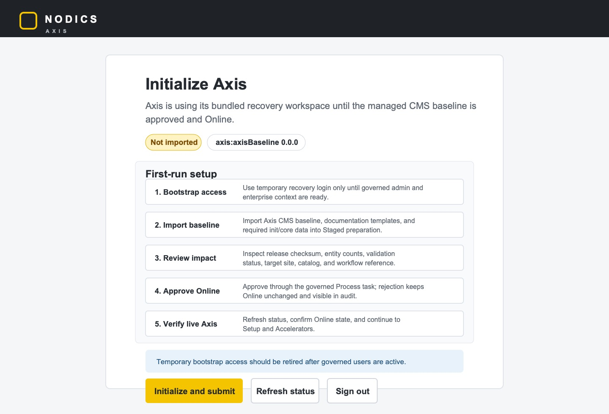

Follow this first-run path:

1. Confirm the release chip points to the Axis baseline release.
2. Click **Initialize and submit** to import the baseline into Staged and submit
   the governed publication request.
3. Click **Refresh status** until the workspace shows the approval-ready state.
4. Open the publication details or Process approval task and review the release
   checksum, entity counts, validation status, target site, catalog, workflow
   reference, impact, and recovery guidance.
5. Approve the publication so the managed Axis CMS baseline becomes Online.
6. Refresh or reopen Axis and verify that the bundled recovery workspace has
   retired.

Do not skip this by writing Axis data directly to Online. The first launch
still follows the same Staged, Process approval, Online publication, and audit
principles as other governed content.

## Open Axis

Open Axis:

```text
http://localhost:3100
```

After the first-launch baseline is Online, or when the schema already has Axis
data, the first screen should be the managed employee login page.

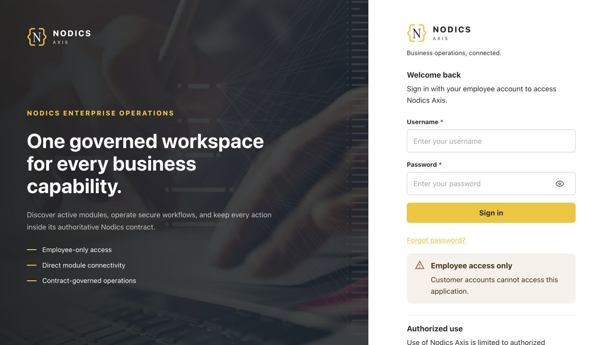

Use the local reference admin account:

```text
Username: admin
Password: adminPassword
```

After login, Axis should land on the dashboard.

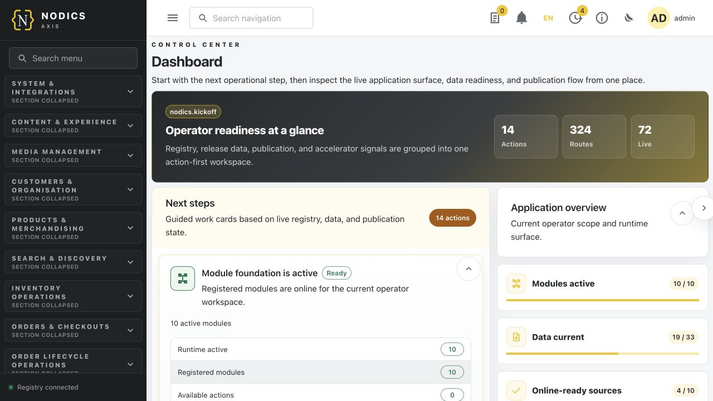

Use the dashboard as the operator map:

| Dashboard area | What to check |
| --- | --- |
| Next actions | Shows whether the next step is registry, data import, publication, or application verification. |
| Application overview | Shows active modules, data readiness, Online-ready sources, routes, workbenches, and tenant. |
| Release and publication cards | Show whether data is current, pending, blocked, or waiting for approval. |
| Application cards | Show whether Nexus and Agora are Online-ready or still blocked. |

## Register and activate modules

Open **System and Integrations -> Module Registry**, or navigate directly:

```text
http://localhost:3100/registry
```

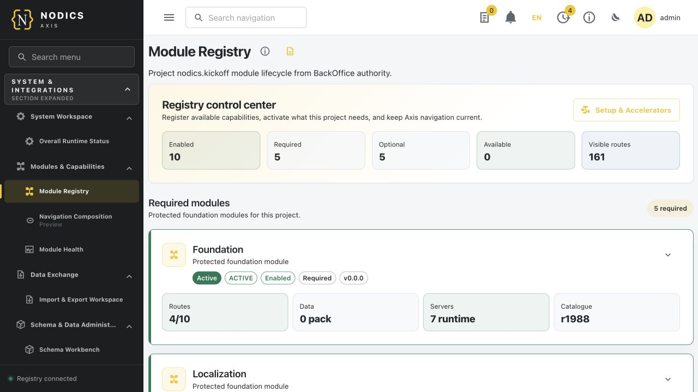

The registry is not only a visual list. It is the backend-owned activation
surface for functional capabilities. A capability should be registered and
active before importing an application pack that depends on it.

Check these states:

| Capability group | Expected local result |
| --- | --- |
| Core, Platform, WCMS | Registered and active. These are the foundation. |
| Process and Automation | Active when workflow, approval, and cronjob behavior is needed. |
| Commerce and Discovery | Active before Agora catalog and product search setup. |
| Engagement | Active before contact, review, feedback, or communication journeys are verified. |

If an accelerator says setup is blocked, return to Module Registry and activate
the missing capability instead of forcing import data manually.

## Install release data

Open **System and Integrations -> Import and Export Workspace**, or navigate
directly:

```text
http://localhost:3100/operations/imports-exports
```

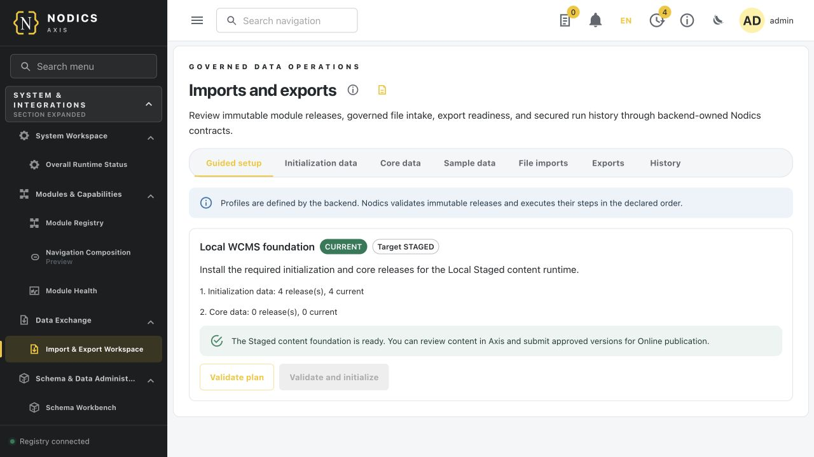

Start with **Guided setup**. Guided profiles are declared by backend runtimes
under `data.dataReleases.initializationProfiles`; Axis discovers and renders
them. Axis must not invent data authority or silently combine release lists.

Use this order:

| Guided profile | Why it matters |
| --- | --- |
| Local Platform foundation | Prepares login, profile, catalog, authorization, localization, and BackOffice data. |
| Local WCMS foundation | Prepares Staged content runtime, CMS baseline, and publication preparation. |
| Local Documentation foundation | Prepares WCMS prerequisites before documentation content packs are reviewed and published. |
| Local Commerce foundation | Prepares operational Commerce services. |
| Local Commerce Staged catalog foundation | Prepares Agora catalog, product, price, inventory, and search preview data. |
| Local Process and Workflow foundation | Prepares approval and workflow definitions. |
| Local Engagement foundation | Prepares communication and customer interaction data. |

For each profile:

1. Read the label and description.
2. Review the step list and release counts.
3. Click **Validate plan**.
4. If validation passes and releases are not current, click **Validate and initialize**.
5. Refresh the workspace and confirm the profile becomes `CURRENT` or shows a
   clear operator-friendly blocker.

Use **Initialization data**, **Core data**, and **Sample data** only when an
administrator needs advanced release-level control.

## Initialize applications

Open **Publishing -> Setup and Accelerators**, or navigate directly:

```text
http://localhost:3100/setup-accelerators
```

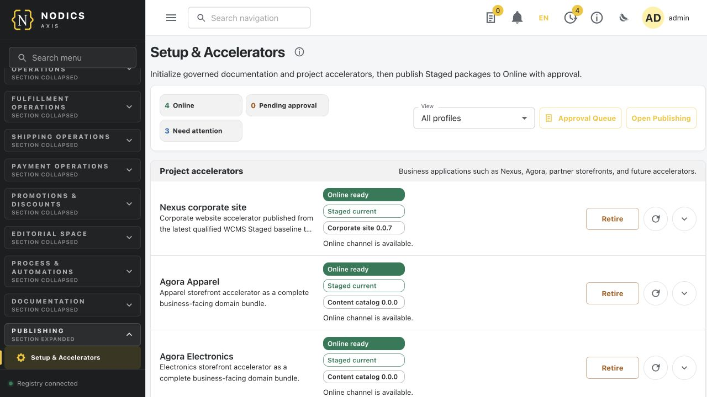

This page prepares project accelerators such as Nexus and Agora. It should
show friendly status instead of raw technical exceptions.

| Status | Meaning |
| --- | --- |
| Setup blocked | A required capability, content catalog, communication, or data foundation is missing. Fix the blocker first. |
| Ready to initialize | Required capabilities are active and the pack can be prepared. |
| Staged current | Staged data is installed at the expected version and checksum. |
| Pending approval | Staged data is ready but not yet Online. |
| Online ready | Online publication is available and public apps can render it. |

Initialize Nexus and Agora only after their blockers are resolved. A complete
application pack may prepare CMS pages, routes, navigation, media records,
physical media artifacts, Commerce catalog data, search/discovery data, and
operational data owned by that application.

## Approve and publish

Open the approval queue:

```text
http://localhost:3100/process/tasks
```

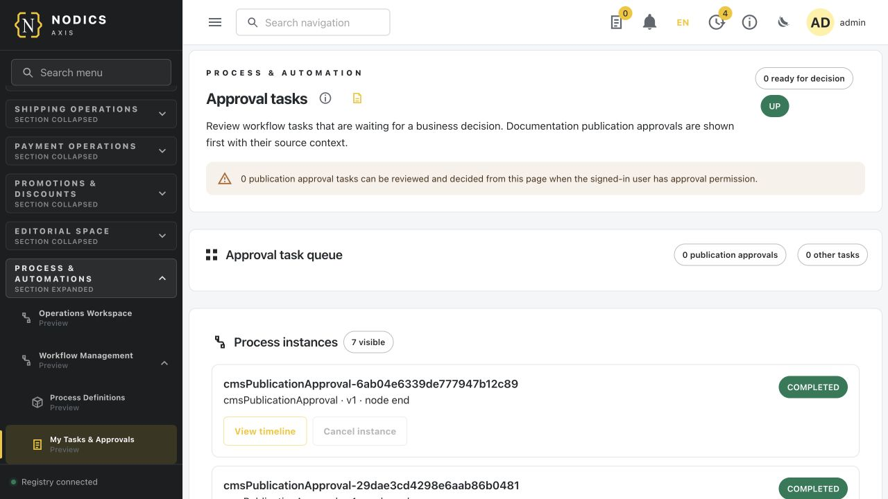

Review the publication evidence before approving. Approval should explain what
will be visible Online, which source release is involved, and what rollback
means if activation fails.

Open the Publishing dashboard:

```text
http://localhost:3100/publishing
```

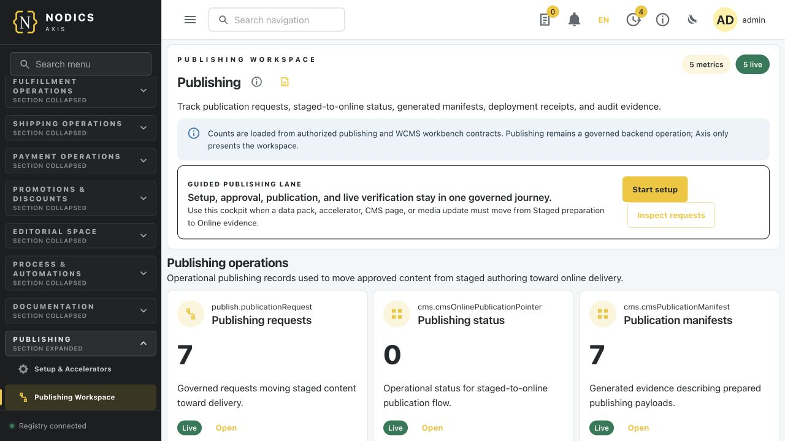

Publishing is the only path from Staged content to Online content. Do not
write directly into Online schema or Online media storage. If publication is
blocked, fix the Staged data, approval task, workflow configuration, media
dependency, or Online runtime readiness that the page reports.

## Publish documentation

Open Documentation:

```text
http://localhost:3100/docs
```

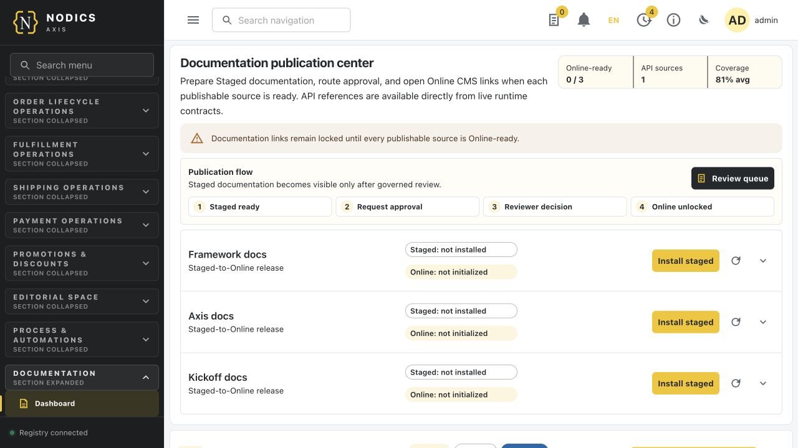

Framework, Axis, and Kickoff documentation are governed content packs. Import
and approve them through Axis and Process. They should flow from Staged to
Online like other publishable content.

Open Swagger/OpenAPI:

```text
http://localhost:3100/docs/swaggers
```

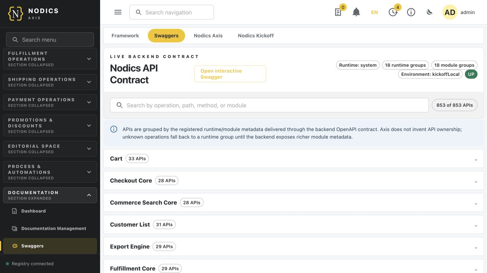

Swagger is different from documentation content packs. It is generated from
live runtime API contracts and should remain accessible when API sources are
available, even if documentation publication is still waiting for approval.

## Verify Nexus

Open Nexus:

```text
http://localhost:3200
```

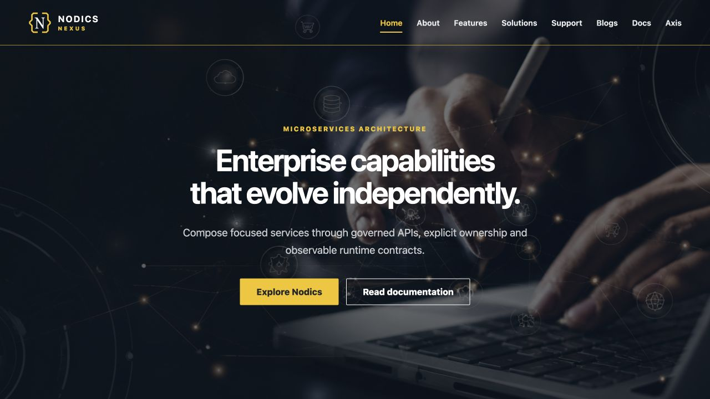

Verify:

| Area | Evidence |
| --- | --- |
| Header and navigation | Links come from Online content and route contracts. |
| Hero and content sections | Text, images, and components render from published content. |
| Documentation links | Documentation routes open only when their packs are Online or intentionally available. |
| No maintenance fallback | The app should not show setup or unpublished-content fallback after Online publication succeeds. |

## Verify Agora Apparel

Open Agora:

```text
http://localhost:3300
```

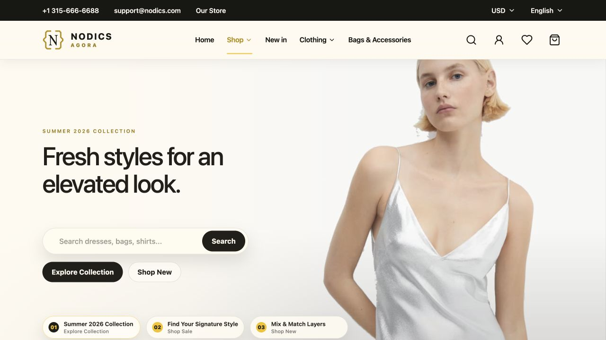

Verify:

| Area | Evidence |
| --- | --- |
| Storefront home | Banner, category, and merchandising content render from Online/Staged-approved sources. |
| Product catalog | Product, category, price, inventory, and image data are present. |
| Search and discovery | Product search and filters return meaningful results. |
| Media | Product and CMS images load through the media contract, not hardcoded frontend paths. |

## Troubleshooting checkpoints

| Symptom | Likely cause | Where to fix |
| --- | --- | --- |
| Axis login page does not open | Axis frontend is not running or `3100` is occupied. | Run `npm run topology:status`, then restart the owned topology. |
| Bundled recovery login appears every time | The managed Axis baseline is not Online, publication was not approved, or the CMS route did not load. | Use the first-launch initialization workspace, then check Process approval and WCMS Online readiness. |
| Initialize Axis stays approval pending | The baseline import finished, but the governed Process task has not been approved or published. | Open `/process/tasks`, review the task, approve it, then refresh Axis. |
| Login fails for local admin | Platform/Profile is unavailable or seed data is missing. | Check Platform server logs and guided Platform foundation data. |
| Dashboard shows few modules | Module Registry has not activated optional capabilities. | Open `/registry` and activate required capabilities. |
| Guided setup shows only one profile after config changes | Servers are still running old runtime configuration. | Restart the local topology and reload Axis. |
| Accelerator setup is blocked | A required capability, catalog, communication, or release dependency is missing. | Read the friendly blocker, then fix registry or release data. |
| Approval queue is empty | The pack is not initialized, workflow data is missing, or the task is already processed. | Check Setup and Accelerators, Process foundation, and Publishing dashboard. |
| Nexus or Agora shows fallback content | Staged data was not approved/published to Online. | Publish through Process and verify WCMS Online readiness. |
| Images are broken | Physical media assets did not import or publish with media records. | Check media import evidence, asset manifest, and Online media publication. |

## Screenshot maintenance rule

Screenshots are part of the onboarding contract. When the first-launch
recovery login, Initialize Axis workspace, managed login page, dashboard,
registry, imports, setup, publishing, documentation, Nexus, or Agora journey
changes materially, update the matching image under:

```text
docs/assets/images/local-setup/
```

Then regenerate and validate the Kickoff documentation content pack:

```bash
npm run docs:generate
npm run docs:check
```

Keep screenshots focused on decision points. Do not add decorative images that
hide the actual operator action, backend state, or public verification result.

## Common mistakes

Avoid these mistakes during a first local setup:

- Opening Nexus or Agora first and assuming a running frontend means Online
  data has been published.
- Importing sample data before the required module capability is registered and
  active.
- Treating Axis as the data authority. Axis renders backend-owned profiles,
  releases, approvals, and actions.
- Restarting only the frontend after changing backend runtime profile
  configuration.
- Approving publication before reviewing the Staged source, version, media, and
  target Online role.
- Fixing broken images in the frontend instead of checking media import,
  physical asset staging, media records, and Online media publication.
- Hand-editing generated documentation records instead of changing the authored
  markdown and regenerating the content pack.

## Verification

Run these commands after changing this guide, screenshots, catalogue metadata,
or setup behavior:

```bash
npm run docs:generate
npm run docs:check
npm run nodics:project:validate
```

When setup behavior changes, also run the guided initialization and local
qualification contracts:

```bash
npm run acceptance:guided-initialization
npm run test:qualification
```

Browser verification should include the first-launch recovery login and
Initialize Axis workspace on a fresh schema, then managed Axis login,
dashboard, Module Registry, Imports and Exports, Setup and Accelerators,
Process approval queue, Publishing, Documentation, Swagger, Nexus, and Agora.
Capture new screenshots when any of those screens changes materially.

## Final proof

A new user can call the local setup complete only after this evidence exists:

1. `npm run topology:status` shows the owned local runtimes are reachable.
2. On a fresh schema, bundled Axis recovery login opens and the Initialize Axis
   workspace can submit the baseline.
3. After baseline approval, managed Axis login works with the local admin.
4. Dashboard, Module Registry, Imports and Exports, Setup and Accelerators,
   Process tasks, Publishing, Documentation, and Swagger pages open.
5. Required modules are active.
6. Guided setup profiles are current or have a clear blocker.
7. Application packs are Staged current or Online ready.
8. Publication approvals have been processed.
9. Nexus and Agora render public Online experiences in the browser.
10. Media images load on public pages.
11. Any remaining blocker has a friendly operator message and a developer owner.
