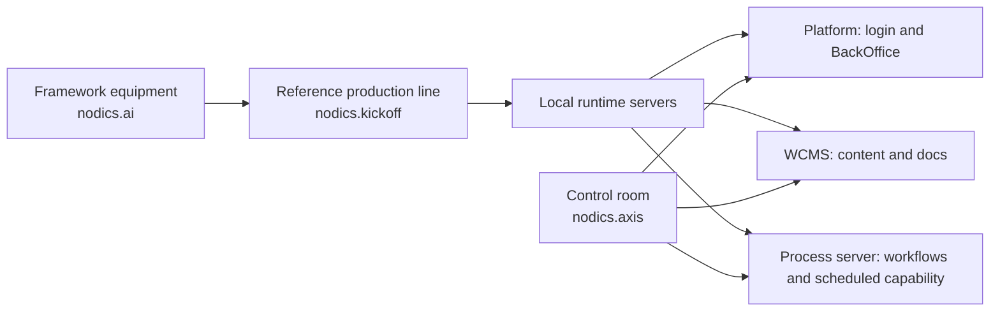
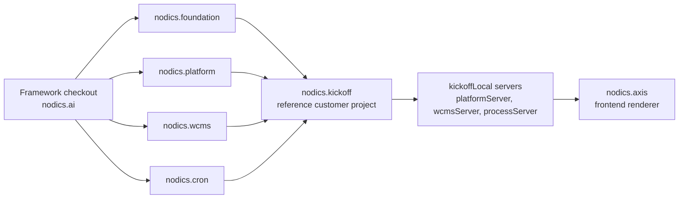

# Kickoff Project Overview

Nodics Kickoff is the reference customer project for running Nodics locally and
demonstrating how a partner or customer project consumes the framework. It is
not a standard Nodics functional module such as Core, Platform, WCMS, or Cron.
It is a project-owned runtime composition that shows how those modules can be
assembled without copying framework source.

Kickoff owns project structure, local environment wiring, project modules,
sample customization points, and project documentation. Framework
documentation belongs in `nodics.docs`; Axis product documentation belongs in
the Platform `axis` backend module; browser renderers belong in `nodics.axis`.
Kickoff-wide documentation source belongs in this repository under `docs/` and
is generated into this repository's governed content pack. Documentation for a
specific installed application belongs under that application's data module,
for example `modules/nexusData/docs/` or `modules/agoraData/docs/`.

## Why Kickoff exists

Kickoff exists so a new team can feel Nodics before they design their own
project. A partner should be able to clone the framework, clone the reference
project, run a small set of commands, log in to Axis, and see the major backend
capabilities working together.

This matters because enterprise framework adoption usually fails at the first
hour. If the first experience requires a developer to understand every module,
every dependency, every data import, and every environment property, the
framework feels heavy even when the architecture is good. Kickoff keeps the
first journey small: start the runtime, import governed seed data, open Axis,
read the documentation, and then make one safe customization.

For a business evaluator, Kickoff demonstrates that Nodics can support a real
customer project without asking the customer to fork framework code. For a
developer, it shows the concrete folder shape, package dependency model,
environment wiring, server start commands, and project-owned extension points.
For an operator, it shows how one local project can run Platform, WCMS, and a
combined Business Process & Automation runtime while preserving the same module
ownership rules that production will use.

## What a new customer should learn

Kickoff should answer the questions a new customer asks before trusting a
framework:

| Question | Kickoff answer |
| --- | --- |
| Can I run it locally without designing my full product first? | Yes. Kickoff provides ready local Platform, WCMS, Process/Cron, and Axis wiring. |
| Do I have to edit framework source to customize? | No. Customer modules and server/environment configuration load after framework modules. |
| Can documentation and content be imported like real governed data? | Yes. Kickoff ships a project-owned documentation content pack. |
| Can optional modules be added later? | Yes. Cron demonstrates observed optional runtime capability and registry lifecycle. |
| Can my real project use a different folder layout? | Yes. `NODICS_FRAMEWORK_ROOT` points Kickoff to the framework checkout. |

This makes Kickoff more than a sample app. It is the adoption proof for the
whole framework.

## Beginner mental model

Think of `nodics.ai` as the factory equipment, `nodics.kickoff` as the sample
production line, and `nodics.axis` as the control room screen. The factory
equipment provides standard capabilities such as Core, Platform, WCMS, Media,
Cron, and Process. The sample production line decides which equipment to
connect for a local demonstration. The control room screen connects to the
running backend and shows only the capabilities that the backend says are
available and authorized.

Kickoff is not the product every customer must ship. It is the smallest
complete example of how a customer product can be structured.

The metaphor is useful because it prevents a common mistake. You do not move
factory equipment into the control room, and you do not hardcode control-room
screens into the production line. Each part has a job.

## What Kickoff demonstrates

- how a customer project depends on Nodics framework packages;
- how environment and server modules load after standard functional modules;
- how Platform, WCMS, and Process/Cron can run as separate ownership domains
  while sharing a local automation server;
- how project modules can customize runtime behavior without renaming the
  standard functional module identity;
- how customer-owned documentation can appear in Axis beside Framework,
  Swaggers, and Nodics Axis.

## Source map

The important Kickoff locations are:

- `package.json` describes the project package and local scripts;
- `.env` describes developer-specific framework checkout location and local
  overrides;
- `src/sync-framework-dependencies.js` prepares local framework package links;
- `src/start-platform-server.js`, `src/start-wcms-server.js`, and
  `src/start-process-server.js` start the core local runtime servers;
- `config/` contains project-level defaults;
- `envs/kickoffLocal/` contains local environment and server composition;
- `modules/` contains project-owned modules and customization examples;
- `docs/` contains authored Kickoff-wide documentation;
- `data/core/data/documentation/` and the documentation section in `data/manifest.json` are
  generated content-pack outputs.

Authored documentation is the source. Generated records are the importable CMS
projection. Do not hand-edit generated records to fix documentation.

## Runtime boundary

Kickoff is loaded after framework modules. That means it can contribute
configuration, project modules, and project-owned documentation, but it must not
move framework behavior into the customer repository. A customer extension such
as `kickoff.platform` may customize Platform implementation while the
business-facing functional identity remains `nodics.platform`.

Runtime composition and code dependency are related but different. Package
dependencies make framework modules available to the project. Server
configuration decides which modules are loaded, in which order, for a specific
runtime process. Service override behavior follows module loading and indexes,
not simply the order in `package.json`.

This diagram is intentionally simple. Kickoff does not own the framework
modules and Axis does not own backend data. Kickoff composes the backend
runtime, and Axis renders whatever Platform/WCMS say is active, authorized,
and available.

## First customization promise

A beginner should be able to make a first safe customization without fear.
Good first customizations are intentionally small:

- change a local property in the correct environment or server file;
- add or update a Kickoff documentation page;
- add a project-only service in a Kickoff module;
- add project sample data that belongs to the customer project;
- change WCMS-managed content through Axis after import.

Bad first customizations are also easy to name:

- editing `nodics.foundation` because a project-specific rule is needed;
- putting CMS import data into `nodics.axis`;
- changing generated files without changing their source;
- changing a standard functional module identity because a project customized
  implementation;
- hiding a status, error code, permission, or lifecycle state in an unrelated
  property file.

Kickoff exists to teach the safe path first.

## Beginner story

A new developer can think of Kickoff as a training project:

1. It shows where a customer project keeps project modules.
2. It shows where local environment/server configuration lives.
3. It shows how to point at a framework checkout that may live anywhere on the
   machine.
4. It starts Platform, WCMS, and the composed Process/Cron automation runtime
   without asking the developer to create a production topology first.
5. It ships project-owned documentation so Axis can show framework docs,
   Axis docs, and customer-project docs side by side.

After the developer understands this reference shape, they can create a real
customer project with the same rules but different business modules, branding,
data, environments, and deployment choices.

## Documentation boundary

Kickoff docs are imported through WCMS like any other governed CMS content
pack. Axis renders the resolved CMS page and does not own the documentation
records. The BackOffice registry exposes the documentation source so the Axis
Documentation dashboard can discover it.

## Common mistakes

- Do not put framework documentation in Kickoff unless the page is explaining
  how Kickoff consumes the framework.
- Do not copy `nodics.foundation`, `nodics.platform`, `nodics.wcms`, or `nodics.cron`
  source into this repository.
- Do not move Axis renderers or browser code into Kickoff.
- Do not assume a customer project will always sit beside `nodics.ai`; use the
  framework-root configuration.
- Do not change generated content-pack files without regenerating from source.
- Do not rename functional capabilities when a customer module only customizes
  their implementation.

## How to know Kickoff is working

Kickoff is healthy when Platform starts, WCMS starts, the module registry shows
mandatory functional modules as active, optional modules can be registered
through Axis, documentation content packs can be imported or updated through
BackOffice/WCMS, and Axis can render Framework, Swaggers, Nodics Axis, and
Nodics Kickoff documentation from backend-owned sources.

## Verification

Verify Kickoff as a reference customer project by proving that it can run the
framework without becoming framework source. The local proof is to configure
the framework root, install dependencies, start Platform, WCMS, and Process
when needed, start Axis, log in, import required data releases, and open the
Kickoff documentation product. The project should contribute its own docs and
sample behavior while framework docs still come from `nodics.docs` and Axis
product docs still come from the Platform Axis backend module.

For repository verification, run the Kickoff documentation contract test,
runtime prepare tests, and local acceptance script when project behavior,
environment/server configuration, documentation packs, or generated data
change. If a future customer copies the reference project, the docs should
teach them where to replace the project name and where not to create
framework-level assumptions.

## What to read next

Read Kickoff in this order:

1. **Local runtime topology** to understand which servers start and why.
2. **Local acceptance checklist** to prove the environment from a fresh local
   database.
3. **Customer customization guide** to learn how to change behavior without
   damaging framework ownership.
4. Framework documentation for Core, Platform, WCMS, Cron, imports, and DevOps
   once the local system is running.

## Continue

- [Local runtime topology](local-runtime.md)
- [Customer customization guide](customization-guide.md)
