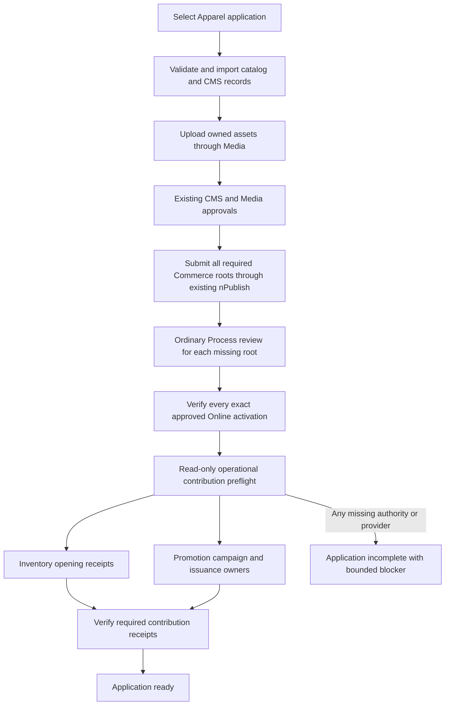

# Apparel coordinated business pack

## Outcome and ownership

A partner selecting the Apparel reference application should not need separate
manual stock seeding or campaign-counter writes after installing products and
CMS content. The existing BackOffice application initialization profile selects
the whole business setup, including the application's images. Framework
documentation remains an independently selectable `docs-v001` pack. This Agora
module owns branded sample choices; Inventory and Promotion own their operations.
The Apparel accelerator remains the reusable domain extension, not a second
copy of these branded records.

## Ordered lifecycle

`DATA_RELEASE` steps default to `BEFORE_PUBLICATION`. The two operational
contributions explicitly declare `AFTER_PUBLICATION`, targeting `commerce` and
runtime role `COMMERCE`. A status read only inspects. A user-initiated setup
action runs admitted operations through the existing nImport release machinery
using the original signed operator. Approval-pending, rollback, retirement and
ordinary startup do not issue stock or coupons. Retrying the action is not
permission to reset consumed quantities or campaign budgets.

| Manifest section | Source and role | Owner responsibility |
| --- | --- | --- |
| agoraApparelCommerceCatalog | sample-v001/commerce; COMMERCE_STAGED | Publishable products, variants, prices, campaign policy, warehouse and search policy |
| agoraApparelContentCatalog | sample-v001/content; WCMS_STAGED | CMS records and owned image files, coordinated with Media |
| agoraApparelPublicationPlan | sample-v001/publication; COMMERCE_STAGED | Inert intents for 61 Products, Pricing, Inventory, Tax and three Promotions; no CRUD installer or approval authority |
| agoraApparelOpeningStock | sample-v001/operations; COMMERCE | Inventory first-receipt instructions, never balance snapshots |
| agoraApparelPromotionSetup | sample-v001/operations; COMMERCE | Pinned campaign and coupon issuance intent, never pre-owned customer coupons |

## Opening stock

`inventoryOpening.json` has contract version 1 and 464 instructions: one for
every active physical variant, 40 whole units each, in
`agoraApparelWarehouse`, with Store `agoraMainStore` and locale `en`.
The three digital coupon variants are excluded. Product, variant and SKU must
match the activated Product policy; the warehouse must belong to the same
authenticated tenant and enterprise. Source tests derive coverage from the
actual variant records, so adding a variant without an instruction fails the gate.

The pack supplies only code, Store, locale, warehouse, product, variant, SKU,
positive quantity and receipt reference. Tenant, enterprise, operator, balance
identities and replay digests are resolved by Inventory. No `available`,
`reserved`, `allocated`, revision or prebuilt balance enters the payload.

Inventory requires the signed human's existing `commerce.inventory.operate`
permission and installed provider evidence: multi-record transactions, eligible
schemas and unique persisted identities. It atomically inserts the first
balance, RECEIPT movement and private original-command evidence. A retry after
three units have been sold still leaves 37 units; it never restores 40.
Changed intent, preexisting unproven stock, corrupt evidence or failed database
reads block rather than repair. A response lost after commit is recovered by
reading the original evidence. Each receipt is atomic, not the entire 464-item
batch; interrupted runs require retained owner/release evidence and the existing
nImport execution-recovery rules. Do not delete a RUNNING receipt to retry.

## Campaigns and coupon secrets

Campaign policy is publishable data; current spending is operational state.
First-use budget admission must pin an activated policy and preserve its original
admission evidence. Existing spending, redemptions, ledgers, batches or coupons
prevent unproven initialization. Repeating the same admitted setup must retain
the current spend and revision rather than write zero again.

`promotionSetup.json` pins the initial version-zero projection of all three
application campaign policies through Promotion's own `capturePolicy` and
`fingerprint` owners. Each source campaign explicitly references the canonical
Profile enterprise as both issuer and vendor. A compatibility enterprise code
alone cannot qualify secure issuance. The campaign setup fingerprint and
publication-plan fingerprint must both be regenerated from the same reviewed
policy; tests independently compare these pins and all declared file hashes.
The first-use owner preserves those references in the operational campaign.
Corrected unreleased v001 bytes require governed fresh initialization when an
older checksum is already installed; never rewrite its import receipt or widen
same-version replacement policy.

The initial policy pins use the existing `capturePolicy` and
canonical fingerprint helper. It reserves issuance intents for Style Pass 5
(100 coupons), Capsule Edit 10 (50), and Private Sale 20 (20). These quantities
are application sample choices, not minted codes or live counts. A different
activated policy/version requires an explicitly reviewed matching pin; source
checksums and intended versions cannot stand in for approved Online evidence.
Every campaign root must be explicitly selected for this Store and activated.
The native delivery selection explicitly contains all three campaign roots; each
still requires normal approved activation before the full pack can execute.
No setup instruction expands
those selections or approves its own policy.

The publication plan is a required GOVERNED_PUBLICATIONS AFTER_PUBLICATION step.
Missing or interrupted STAGED/VALIDATED requests offer INITIALIZE to submit or
resume existing approvals. Pending approvals expose Process references but cannot
preflight opening data. All 67 roots must be CURRENT, qualified against exact
retained sources and owner-specific target receipts. Source intent names are not
proof of Online delivery. FAILED or ambiguous requests require owner review.

Coupon issuance instructions must not contain plaintext redeemable codes,
precomputed customer ownership, sold/delivered status or payment evidence. A
generated hash alone cannot support customer reveal. Promotion uses nSystem's
purpose-bound authenticated encryption with deployment-owned key input, retains
encrypted tokens atomically per batch and protects generic reads/exports/writes.
Without real keys, installed indexes, allowed transactions and private capture,
the contribution deliberately blocks. This is not a
success with an empty coupon pool. The normal purchase, payment, delivery and
owner-checked reveal journey must still run before a coupon can discount checkout.

## Partner customization and troubleshooting

| Situation | Expected action |
| --- | --- |
| Partner changes products or quantities | Override the owning application data through existing module layering; regenerate declared hashes and run source coverage gates before installation |
| Documentation is not wanted | Leave the documentation pack unselected; business setup has no docs dependency |
| CMS or Media approval pending | Complete the existing approvals; operational steps remain deferred |
| Activated Product, warehouse or campaign missing | Publish/activate the correct owning policy; do not use mutable fallback reads |
| Transaction topology or unique indexes missing | Qualify the database through its owner; never set a success flag or import stock snapshots |
| Existing stock or spend lacks original admission evidence | Use reviewed owner reconciliation; do not reset counters |
| Token retention owner missing | Implement and qualify the existing private issuance/reveal boundary before enabling coupon-dependent acceptance |
| A setup response is lost | Inspect retained receipts and owner evidence; never repeat quantities blindly |

## Reviewed reversal selection

The application contributes `order.runtimeRoleProfiles.COMMERCE` selectors for
the exact Store `agoraMainStore`. Order resolves that identity from retained
checkout evidence, never a caller's Store field. The selected physical owner is
Fulfillment Core; digital purchases retain Digital Core ownership. This selection
does not replace signed staff scope, the reviewed preview and original approval,
shipment/receipt/inspection authority, Inventory transactions or Payment receipts.
Circa's existing prefix and owner selection remain separate. Unselected Apparel,
Electronics and Telco compositions gain no Apparel reversal scope.

Partners may intentionally disable the Store key in their later configuration.
They must not broaden the selection to a shared storefront prefix or enable a
real financial/carrier provider using an offline qualification flag. Local tests
with simulator receipts are explicitly no-money demonstrations, not real refunds.

The same selected application contributes
`fulfillmentCore.runtimeRoleProfiles.COMMERCE.physicalOperations` with
`enabled: true` and `evidenceMode: MANUAL_ATTESTATION`. Framework defaults remain
disabled. Normal staff scope, original retained Store, Order and consignment
bindings still govern every command. The manual dispatch, return receipt and
inspection routes are owner records, not carrier telemetry. Local synthetic
fixtures must be labelled as such; they never qualify physical handover or goods.

## Verification boundary

Run `node --test modules/agora.apparel/test/apparelOperationalPack.test.js`,
`npm run test:data-ownership`, and `npm run test:multi-domain` from Kickoff.
Framework Inventory tests verify atomicity, ambiguity, authority, installed-index
checks and replay using independent generated-service ports. nImport and
BackOffice tests verify immutable-byte qualification and ordered phases.
These gates are not proof of an installed provider, approved Online publication,
secure coupon delivery or successful checkout. Native acceptance evidence must
separately record those outcomes, blockers and runtime cleanup.
