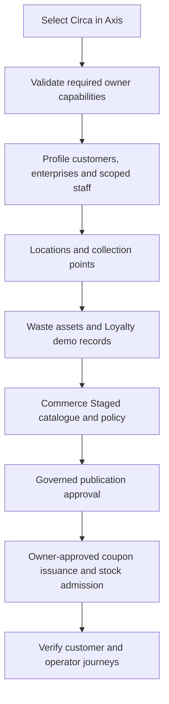

# Circa Demo Dataset

## One Customer Demonstration

Circa has one demo dataset. Importing its website alone is not completion. The
existing Axis Circa initialization profile selects all required owner sections;
there is no separate full-demo profile or partial-demo option.

Customer-specific identities and sample records live in `circa.ewaste/data`.
Profile owns identities and permissions, Location owns coordinates, Waste owns
collection points/assets, Commerce owns offers and coupon operations, Loyalty
owns balances and ledger entries, and WCMS/Media own published presentation.
Project data must not become a replacement importer or business lifecycle engine.

## Dataset Inventory

| Content                        | Source content                                                                                                                                        |
| ------------------------------ | ----------------------------------------------------------------------------------------------------------------------------------------------------- |
| Enterprises                    | Circa Integrated Services, LoopCycle Recycling, RenewWorks Repair & Reuse, LoopLink Logistics, GreenPerks Group, GreenPerks Online, GreenPerks Retail |
| Staff                          | Two distinct demo staff per new enterprise, in addition to the existing seven Circa operational personas                                              |
| Hierarchy                      | GreenPerks Online and Retail are children of GreenPerks Group; other participants are independent                                                     |
| Circa collection points        | Existing `cc-dxb-01`, `cc-dxb-02`, `cc-dxb-03`; operator and asset owner are Circa Integrated Services                                                |
| Other collection points        | Existing framework collection network remains selected, unchanged                                                                                     |
| Redemption outlets             | GreenPerks Hills Cafe and GreenPerks Hills Bistro                                                                                                     |
| Catalogue                      | Five existing asset listings, three existing coupon offers, thirty-five new GreenPerks offers: 43 products in total                                   |
| New offer distribution         | Twelve cafe-only, twelve bistro-only, eleven either-outlet offers                                                                                     |
| New offer purchase-unit target | One hundred per offer, 3,500 in total; the target is not evidence of issued stock                                                                     |
| Purchased rights               | Unique single-use purchased code, thirty days from successful purchase; not thirty days from import                                                   |

New staff logins use `<participant>.<administrator|operator>@circa.local`, where
participant is `integrated`, `recycling`, `repair`, `logistics`, `group`, `online`
or `retail`. These are fictional local identities, not external email recipients.
Their direct enterprise scopes do not grant parent/child administration.
The existing local demo credential convention is retained. Never deploy these
sample credentials or datasets to production or send real invitations to them.

Outlet coordinates identify user-selected test locations. The fictional names
do not imply participation by real venues. Prices are illustrative reward points,
not an AED exchange rate. Discount minimums and caps remain on their campaign;
the stated item benefit must not be replaced by a fabricated monetary discount.

## Import Sequence

This diagram defines the required end-to-end order, not a claim that all steps
already execute in a single current backend preparation call. In particular,
Commerce Online admission cannot be inferred from Staged import or CMS approval.

1. Start the existing local runtimes and sign into Axis as the authorized admin.
2. Open Circa application initialization. Use the existing Circa selection.
3. Validate the selected releases and inspect any owner-reported blockers.
4. Confirm the selected Circa versions are all `0.0.1`: Profile, Operations,
   Location, Waste, Loyalty, Commerce, Commerce Operational, Content and the
   Circa core policy/workspace sections. Customer demo sections use
   `sample-v001`; Waste policy remains `core-v002` so it can compose over the
   matching eWaste core source.
5. Execute the supported imports through nImport. Inspect each durable run receipt,
   including record-level errors. A preflight pass is not a successful row import.
6. Publish the catalogue/policy and Media through their own approval workflows.
7. Admit coupon supply and asset opening stock through Promotion/Inventory owner
   operations. Never import snapshots directly to bypass rejection.
8. Verify the customer journey in Circa and operator journey in Axis. Check the
   catalogue, outlets, centre ownership, staff scope, purchase, wallet deduction,
   delivery, correct-outlet redemption and duplicate-redemption rejection.

## Repeat Imports And Recovery

The active demo release is v001 because the application has not launched and no
customer installation depends on the interim forward-release history. Existing
identity codes are not renamed; the three original offers and five asset products
are preserved inside the unified catalogue. Same-version preflight returns
CURRENT and skips execution; an explicit install of an already-current selection
is rejected without resetting quantities or balances. Fresh-only sample
transaction packs must never overwrite real customer activity.

Failed imports can contain successful rows. Keep their receipts, identify failed
records and repair the actual owner/schema problem; do not drop data or force a
previous version. No owner qualification flag, consent or stock provenance is
manufactured by this dataset.

The operational section also includes the two Profile-owned outlet addresses.
Native employee rows use Profile `saveAll` with exact `code` and `loginId`
constraints. A matching active native account is preserved without creating an
ambiguous duplicate identity.
Conflicting, inactive, service and linked identities are rejected for owner review.
Permission changes and password resets use their own Profile workflows, not a
demo reimport.

## Customization

Before launch, change only the owning demo section inside `sample-v001` and
refresh the manifest checksums. Keep `waste-policy` on the eWaste-aligned
`core-v002` source root unless the framework owner changes the lower-layer core
root too. After a customer installation depends on a release, use a new numbered
source root with nTooling's `planForwardRelease` to preserve previous source
evidence and update the section version and hashes. Keep enterprise, location,
product, variant, price, campaign and outlet references consistent. Add
regression assertions for changed counts, terms and relationships. Run
`npm run test:circa` and the live owner validation.

The 100-unit declaration in variant attributes is demo intent only. It must not
be rendered as available inventory or used to authorize a sale. Runtime supply
comes only from the owning coupon pool and inventory evidence.

## Local Demo Runtime Admission

The `commerce-operational` release contains bounded local demo coupon and
inventory seed records. Circa selects a project-owned admission marker for this
v001 first-start dataset only; ordinary Promotion and Inventory owner decisions
continue to reject unmarked operational snapshots.
Similarly, item-benefit fulfillment, issuer/seller consent and thirty-day purchased
rights require their real qualified owners; source fields alone do not implement
or qualify them. Source tests do not establish live customer acceptance.
