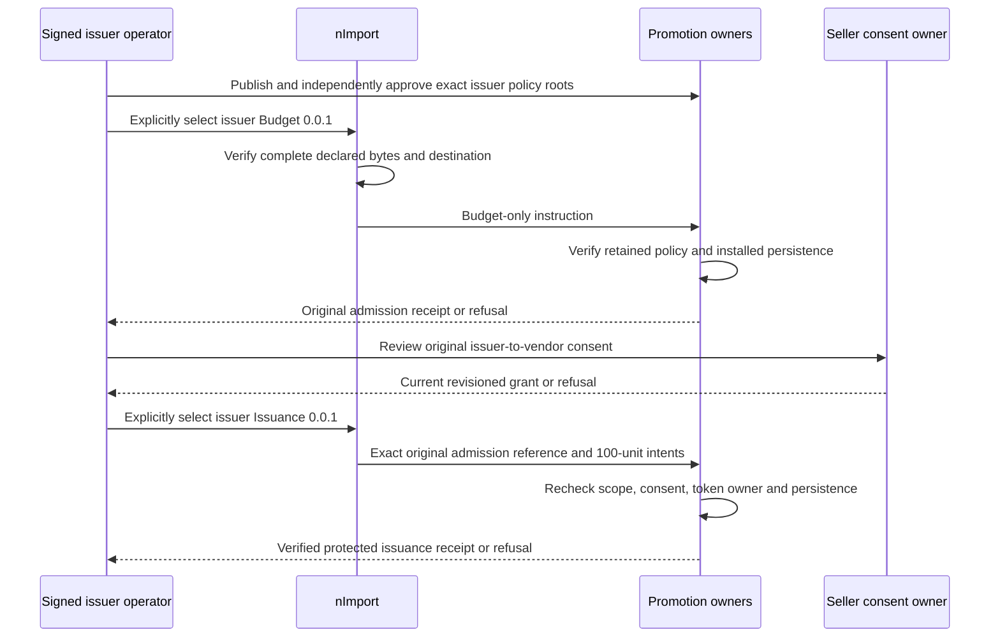

# Circa Reviewed Promotion Setup

## Authority And Baseline

These are customer-owned, fictional `kickoffLocal` instructions, not framework
defaults, operational snapshots or production policy. The human approved the
complete terms on 2026-10-09; the original proposal identity remains in
`test/fixtures/circaDemoPolicyProposal.json`. That review fixture is not imported.
The actual records and instructions are immutable `sample-v001`, semantic
`0.0.1`, and belong to Circa. Existing installations with different bytes must
use governed fresh-baseline recovery; never rewrite an import/admission receipt,
delete a counter or replay a stock snapshot to force readiness.

Promotion's canonical
`nodics.commerce/modules/baseCommerce/modules/promotion/llm/contracts/accelerator-setup-contributions.md`
owns instruction parsing, opening admission and secure issuance. Profile owns
enterprise identity, employees and scopes. nImport owns selection, destinations,
containment, byte hashes and installation receipts. nPublish and Process own
publication and independent approval. These instructions add none of those grants.

The human also approved explicitly simulated ITEM delivery for native Local
testing and retaining disabled already-redeemed benefit reversals. Native
environment selection, exact SIM: reference semantics and the remaining owner
gates are documented in [the application contract](circa-application.md).
Simulation does not change these immutable setup instructions, grant consent,
qualify physical delivery or authorize a used-benefit RELEASE. Docker remains off.

## Source Hierarchy

```text
sample-v001/
  commerce/records/                 marketplace catalogue and issuer policy
  store/records/                    marketplace and four issuer outlet references
  publication/records/             complete 84-root coverage inventory
  publication/catalogue/records/   marketplace publication intents
  publication/greenperks/records/  GREENPERKS_RETAIL publication intents
  publication/renewworks/records/  RENEWWORKS_REPAIR_REUSE publication intents
  publication/loopcycle/records/   LOOPCYCLE_RECYCLING publication intents
  operations/promotion/
    greenperks/{budget,issuance}/records/promotionSetup.json
    renewworks/{budget,issuance}/records/promotionSetup.json
    loopcycle/{budget,issuance}/records/promotionSetup.json
```

The literal directories are `budget` and `issuance`; braces above abbreviate
their shared structure. The old `commerce-operational` section and its raw
coupon, batch and inventory snapshots are retired. Identical legacy snapshots
are also removed from catalogue source. There is no generic saveAll supply path.

## Signed Selections

| Signed enterprise | Publication section | Opening budget section | Later issuance section | Campaigns |
| --- | --- | --- | --- | --- |
| GREENPERKS_ONLINE | circaCataloguePublicationPlan | Not applicable | Not applicable | 43 Product roots plus Pricing, Tax and Inventory policies |
| GREENPERKS_RETAIL | circaGreenPerksPublicationPlan | circaGreenPerksBudget | circaGreenPerksIssuance | 35 |
| RENEWWORKS_REPAIR_REUSE | circaRenewWorksPublicationPlan | circaRenewWorksBudget | circaRenewWorksIssuance | 2 |
| LOOPCYCLE_RECYCLING | circaLoopCyclePublicationPlan | circaLoopCycleBudget | circaLoopCycleIssuance | 1 |

Native kickoffLocal declares four publication subsets and six financial packs as
required `AFTER_PUBLICATION` stages, each with an exact `operatorEnterpriseCode`.
The shared profile no longer selects the retired mixed operational pack. Its six
financial requirements remain visible in other deployments without qualifying
them; only kickoffLocal selects the four publication subsets and pre-sale
ownership-policy prerequisite.

After CMS and its Media dependencies are Online, the signed operator selects one
existing stage through `afterPublicationStepCode`. A budget selection does not
issue coupons. An unselected action dispatches no after-publication stages. Each
selected import is a singleton under the original operator's authority, without
foreign credentials or inferred seller consent. Owner-projected selectable codes
bound the choice. Foreign stages remain required and `AUTHORITY_PENDING`, keeping
aggregate readiness blocked. Local publication readiness permits only the local
selected stage; it does not establish global cross-issuer readiness. Source
validation and reviewed demo values do not establish runtime authorization or
private-owner qualification.

Every release code has the `circa.ewaste:` prefix. The full `circaPublicationPlan`
retains all 84 roots for coverage and comparison, but combines four authorities.
It must not be submitted as one signed-enterprise operation. Each subset uses
the existing publication service with its original human context; source records,
publication input and setup JSON never inject an alternate enterprise or system
authentication. Installed distribution and guided multi-operator orchestration
remain separate owner qualifications, not properties supplied by a data pack.

The marketplace Store and its catalogue records use GREENPERKS_ONLINE. Promotion
policies use their issuer enterprise and canonical Profile enterpriseRef,
issuerEnterpriseRef and vendorEnterpriseRef descriptors. The vendor is always
GREENPERKS_ONLINE. Outlet Store references match the policy issuer exactly:
greenperks-cafe and greenperks-bistro belong to GREENPERKS_RETAIL,
renewworks-repair to RENEWWORKS_REPAIR_REUSE, and loopcycle-accessories to
LOOPCYCLE_RECYCLING. No invented Location coordinates or venue participation
claim is supplied for the two original fictional outlets.

## Ordered Owner Operations

### Existing Staff And Outlet Access

The default native demo adopts existing issuer administrators for the separate
Profile `COMMERCE_SETUP_PUBLISHER` and `COMMERCE_COUPON_ISSUER` responsibilities.
The marketplace administrator needs publication and the separate canonical
`COMMERCE_AXIS_REFUND_REVIEWER` responsibility for reviewed marketplace refunds;
the three coupon issuers
need both. These roles do not grant runtime administration or approval rights.
Role-definition installation does not assign employees. The separately explicit
`circaCommerceStaffAssignments` sample-v001/0.0.1 release predefines all seven
existing demo staff assignments through Profile's additive `addReferenceGroupsAll`
owner. Select its role-definition dependencies first, preserve existing identities
and groups, and require fresh authentication after normal stamp invalidation.
Do not use acceptance-side assignments or replay credential-bearing operations
data. See [predefined staff and preparation order](circa-predefined-commerce-staff.md).

The separate explicit `circaMerchantOutletAccess` sample-v001/0.0.1 PLATFORM
release adds four direct STORE scopes to the existing retail, repair and recycling
operators. Each scope is pinned to its exact enterprise, `digitalCore` and
`commerce.coupon.pos.redeem`. The operators receive Profile's existing
`MERCHANT_OPERATOR` role through the predefined staff section. The outlet release
contains neither employees nor credentials
and never replays the installed `operations` pack. Normal Profile governance and
deny-over-allow resolution remain authoritative. Installing scopes does not
qualify Store persistence, seller consent, merchant benefits or delivery.



Budget packs contain only campaign instructions and an empty couponBatches list.
Issuance repeats the original command, Store/root and policy fingerprint, adding
the exact four-field original admissionContribution: moduleName, releaseCode,
version and checksum. That checksum is nImport's canonical hash over the sorted
declared path/hash pairs, not the bare JSON byte hash. A later pack cannot open a
new counter under this reference, attribute the original admission to itself or
reset spend. Its coupon intent contains only promotionCode, batchCode, quantity
and commandReference. All 38 quantities are exactly 100 and no replenishment
instruction is included.

The consent expiry reviewed by the operator is 2026-11-08T23:59:59.000Z. It is
review context, not a grant in any imported record. Use the existing signed
issuer consent owner with its current revision and exact vendor. A rejected or
expired grant must remain rejected. Consent review, permission and current
employee scope cannot be inferred from the policy references or sample staff.

### Issuer-Reviewed Benefit Purpose

`test/fixtures/circaIssuerConsentReviewInstructions.json` is a separate,
nonimportable review checklist for each of the three issuers. It identifies
every exact campaign, vendor GREENPERKS_ONLINE, reviewed expiry and
`benefitConsumption: "ISSUED_COUPON_BENEFIT_V1"`. This purpose is required by
the canonical budget receiver before issued-coupon benefit consumption; seller
consent without it is not sufficient monetary authority.

Each human issuer reviews the purpose through the existing signed consent
`manage` command, using the freshly read campaign revision and a stable original
command reference. The canonical command calls the vendor `sellerEnterpriseCode`.
Its separate `project` DTO must retain the reviewed benefitConsumption value.
Do not place a grant, revision proof, actor proof or command receipt into any
importable setup payload. Monetary budget intent is not permission to grant this
purpose. Absent, wrong, revoked, expired or stale consent remains a refusal;
neither this checklist nor its local-demo approval repairs a grant automatically.

### Original Asset Sale Policy Selection

Before any of EWA-1047, EWA-1051, EWA-1052, EWA-1055 or EWA-1092 is sold, select
the separate WASTE reference pack `circa.ewaste:circaDigitalOwnershipPolicies`.
It is explicit, local-only, sample-v001/0.0.1 and contains three policy sources,
not bindings, sale events, entitlement receipts, wallet funding or approvals.

| Canonical schema | Exact policy code | Retained intent |
| --- | --- | --- |
| wasteAssetTransferPolicy | CIRCA_LOCAL_DIGITAL_OWNERSHIP_V1 | SELL to counterparty; quantity-one owner flow; lock required; 600-second reservation; original earned rewards retained; no carbon or physical custody transfer |
| wasteRewardSettlementPolicy | CIRCA_LOCAL_DIGITAL_SALE_REWARD_V1 | Entire captured POINTS total to the original current seller, circa/points, scale 2; no platform fee or split |
| wasteCarbonSettlementPolicy | CIRCA_LOCAL_DIGITAL_SALE_CARBON_NONE_V1 | SALE with NONE settlement; no mint or ledger movement |

The transfer source includes the exact approved
`metadata.digitalOwnership.refund` value
`ORIGINAL_TRANSFER_REVERSAL_ONLY_BEFORE_ONWARD_TRANSFER`. The genuine Waste
listing and Digital binding must resolve all three current records, and the
original sale command must retain them **before reservation**. Canonical Waste
seller references remain authoritative; marketplace enterprise is not payee.
The separate fixture `circaDigitalOwnershipPolicySelections.json` provides
selection order and approved asset identities without imported binding state.

Refund requires the original retained term and current policies equal to those
original snapshots, original Order review/approval, captured buyer payment and
original seller earning, plus no onward transfer. Missing original terms or a
later policy edit must remain refused/manual-review-only. Never backfill an old
event or regenerate an original snapshot to pass refund. Insufficient seller
proceeds, changed ownership, disputed receipts and uncertain Payment keep their
owning recovery gates. Physical return/custody is not authorized by this pack.

## Exact Benefit Terms

| Campaign | Issuer | Exact monetary budget |
| --- | --- | --- |
| GP-B12 | GREENPERKS_RETAIL | 2500 |
| GP-A07 | GREENPERKS_RETAIL | 1000 |
| GP-A08 | GREENPERKS_RETAIL | 2000 |
| GP-A09 | GREENPERKS_RETAIL | 3000 |
| GP-A10 | GREENPERKS_RETAIL | 2000 |
| GP-A11 | GREENPERKS_RETAIL | 4000 |
| CPN-GRN-30 | RENEWWORKS_REPAIR_REUSE | 3000 |
| CPN-ECO-15 | LOOPCYCLE_RECYCLING | 3000 |
| CPN-SVC-50 | RENEWWORKS_REPAIR_REUSE | 5000 |

The first original offer promises AED 30, the second 15 percent with maximum
AED 30 discount, and the third AED 50. GreenPerks preserves its reviewed minimum
subtotals and per-use caps. Each of the other 29 campaigns has monetary budget
zero and exact actions.items copied from the approved SKU/quantity map with
unit EACH. No substitutions, display-text inference or staff-delivery attestation
is permitted. The approved quantity-one Waste assets remain a separate
captured-payment/ownership flow; no Inventory balance substitutes for delivery.

The bounded monetary policy totals 25,500 across the nine campaigns: 14,500 for
GreenPerks, 8,000 for RenewWorks and 3,000 for LoopCycle. These are offer
liabilities, not issued customer value or a transfer from a POINTS wallet. The
38 issuance instructions request 3,800 protected coupon units in total; a source
quantity is not a claim that any units were issued or made available Online.
Asset display metadata no longer promises carbon transfer: the reviewed policy
is NO_NEW_MINT_OR_LEDGER_MOVEMENT. Existing canonical Waste seller ownership
remains unchanged; the marketplace catalogue enterprise is a distinct role.

## Source Pins And Recovery

Policy fingerprints come from Promotion capturePolicy on the exact source record
at versionId 0 and the correct issuer context, followed by its canonical
fingerprint. Publication source pins come from the full canonical capture
payload, not a mutable campaign counter. Tests execute the real domain capture
against isolated source ports for all financial roots. Each subset is an exact
partition of the 84-root inventory, so no disabled campaign can be omitted to
obtain readiness. Updating reviewed source bytes requires recomputing policy,
publication, pack and manifest hashes together before a fresh governed install.

| Observation | Required handling |
| --- | --- |
| Wrong signed enterprise or changed scope | Owner refuses; do not switch credentials inside the request |
| Missing original opening admission | Issuance refuses; do not invent a receipt or open through replay |
| Same pinned admission after spend | Read current state; never replenish |
| Absent/revoked/expired seller grant | No new issuance or sale from references alone |
| Missing token retention, transaction, index or private hooks | Preserve the typed owner refusal |
| Approval pending or target/source differs | Resume existing owner workflow; do not declare CURRENT |
| ITEM source not installed/verified | No delivery claim, monetary fallback or staff attestation |
| Old raw snapshot release selected | nImport reports unavailable; no partial Store or supply dispatch |
| Existing same-version receipt with different bytes | Governed recovery, never receipt rewriting |

Source/parser passes establish only the checked-in instructions and refusal
boundaries. They do not qualify native indexes, consent, signed customer
placement, retained delivery, ITEM evidence, asset settlement or browser journeys.
